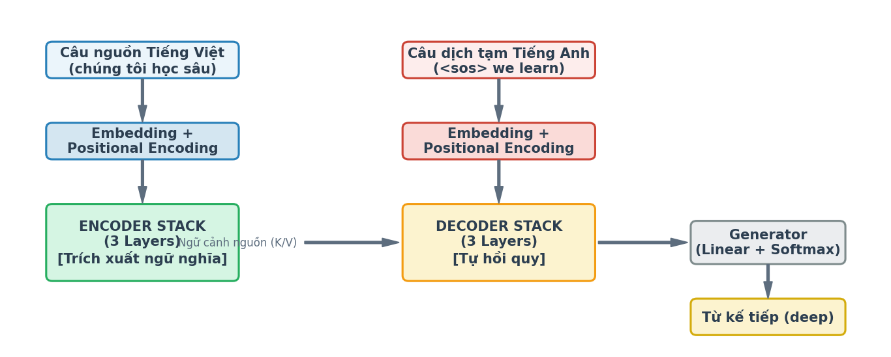
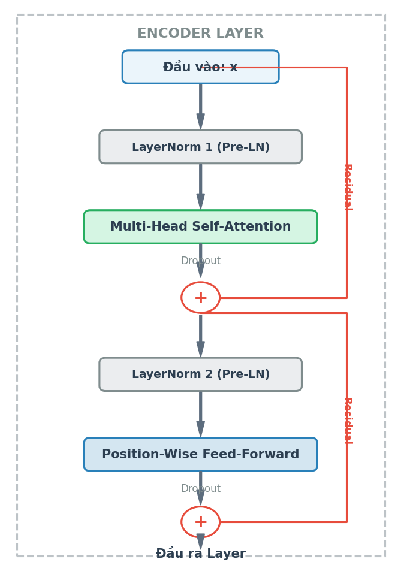
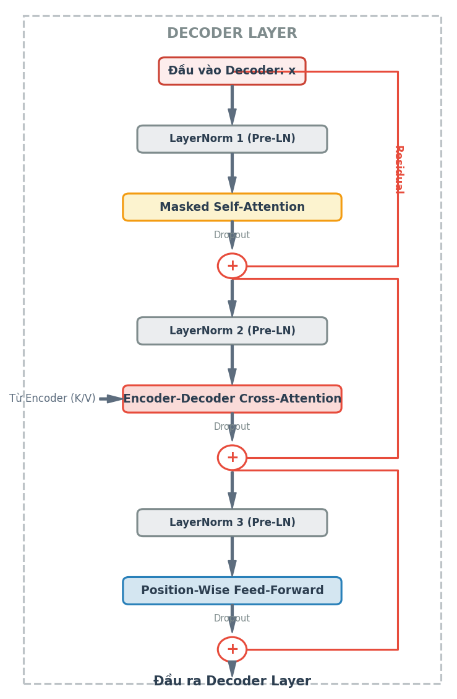
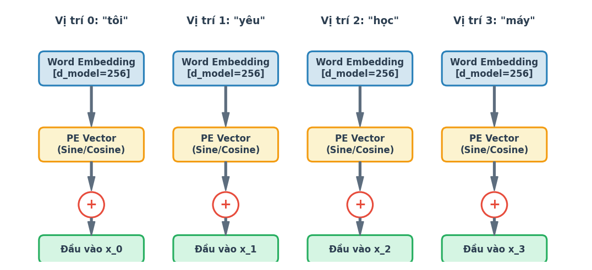
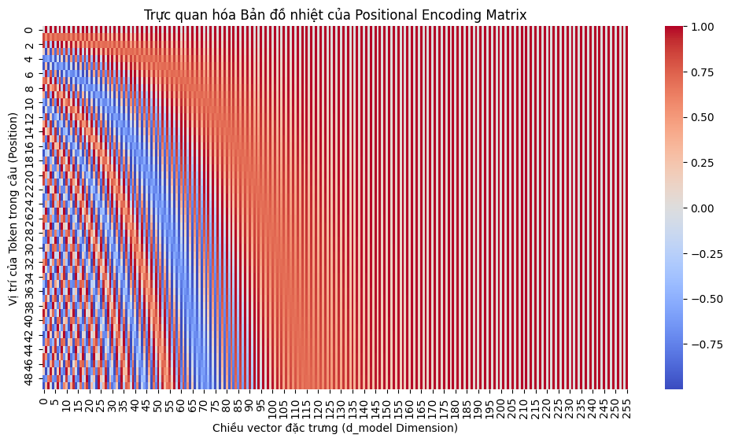
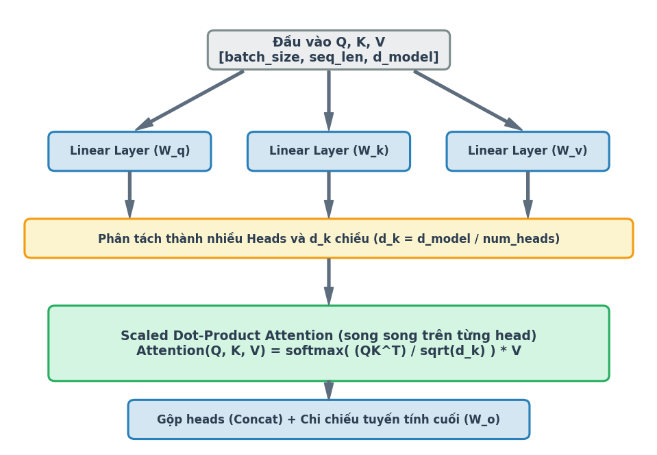
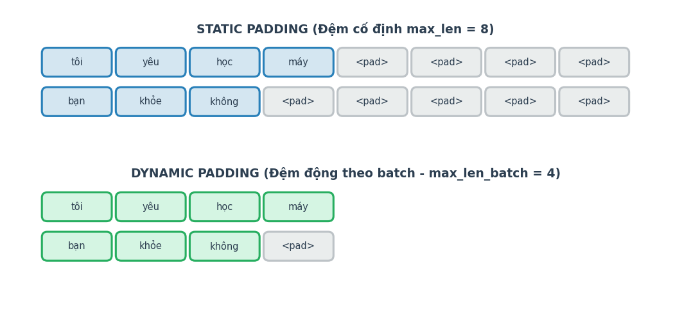
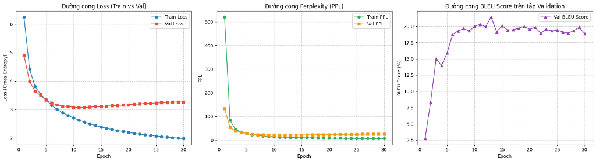
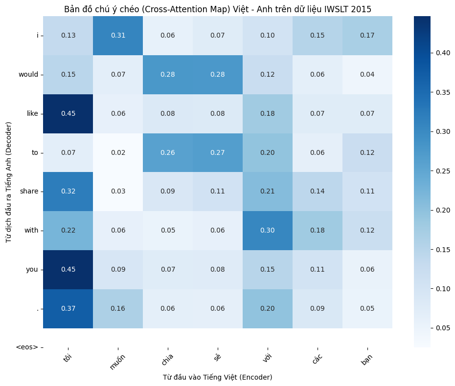

# TÀI LIỆU KHẢO SÁT CHUYÊN SÂU KIẾN TRÚC MINI-TRANSFORMER DỊCH MÁY VIỆT - ANH

## 1. Phân tích Sơ đồ Khối và Mã nguồn thực tế

Khi so sánh sơ đồ luồng dữ liệu tổng quát (hình [overview.png](file:///d:/CN12_2024_2028/NCKH/Code/TransformerFormScratch/overview.png)) với kiến trúc Transformer gốc trong bài báo, xét về mặt nguyên lý cốt lõi, không có sự khác biệt. Tuy nhiên, có hai điểm khác biệt cụ thể về mặt thông số và cách minh họa trong dự án của chúng ta:

1.  **Số lượng tầng (Layers):**
    *   *Trong sơ đồ minh họa:* Cả `ENCODER STACK` và `DECODER STACK` được vẽ với **3 Layers**. Đây là sơ đồ minh họa được đơn giản hóa nhằm tối ưu giao diện trực quan và tương ứng với phiên bản thử nghiệm rút gọn ban đầu.
    *   *Trong mã nguồn thực tế:* Ở phần huấn luyện thực tế (trong file [generate_notebook.py](file:///d:/CN12_2024_2028/NCKH/Code/TransformerFormScratch/generate_notebook.py)), chúng ta khởi tạo mô hình với cấu hình đầy đủ **6 Layers**, `d_model=512` và `d_ff=2048` trùng khớp với cấu hình chuẩn (Base) của bài báo gốc.
2.  **Bài toán áp dụng cụ thể:**
    *   *Trong sơ đồ minh họa:* Sơ đồ được cụ thể hóa cho bài toán dịch máy **Việt - Anh** với ví dụ đầu vào cụ thể (*"Câu nguồn Tiếng Việt (chúng tôi học sâu)"*, *"Câu dịch tạm Tiếng Anh (<sos> we learn)"*).
    *   *Trong bài báo gốc:* Sơ đồ được vẽ ở dạng tổng quát (Inputs và Outputs) và thử nghiệm trên các cặp ngôn ngữ Anh - Đức (English-to-German) và Anh - Pháp (English-to-French).

#### Trực quan hóa Sơ đồ Tổng quan Kiến trúc và Các khối Layers:


*Hình 1.1: Sơ đồ luồng xử lý tổng quan của hệ thống dịch Việt - Anh.*




*Hình 1.2: Sơ đồ khối chi tiết bên trong Encoder Layer và Decoder Layer.*


---

## 2. Khởi tạo và Cấu hình Môi trường Huấn luyện

### 2.1. Mã nguồn Thiết lập Nền tảng
Dưới đây là phần mã khởi tạo cấu hình môi trường và tài nguyên phần cứng cho dự án:

```python
# Cấu hình môi trường PyTorch giải phóng bộ nhớ phân mảnh
import os
os.environ["PYTORCH_ALLOC_CONF"] = "expandable_segments:True"

# Cài đặt thư viện datasets của Hugging Face phục vụ tải dữ liệu
!pip install -q datasets matplotlib seaborn numpy torch tokenizers nltk

import torch
import torch.nn as nn
import torch.optim as optim
from torch.utils.data import Dataset, DataLoader
import math
import numpy as np
import matplotlib.pyplot as plt
import seaborn as sns
import re
from datasets import load_dataset

# Thiết lập seed để đảm bảo kết quả huấn luyện có thể tái lập
torch.manual_seed(42)
np.random.seed(42)

# Cấu hình thiết bị (Ưu tiên GPU CUDA nếu có, ngược lại dùng CPU)
device = torch.device("cuda" if torch.cuda.is_available() else "cpu")
print(f"Notebook đang chạy trên thiết bị chính: {device}")

# Kiểm tra số lượng GPU khả dụng để chuẩn bị cấu hình huấn luyện song song
num_gpus = torch.cuda.device_count()
print(f"Số lượng GPU khả dụng: {num_gpus}")
```

### 2.2. Ý nghĩa và Đóng góp của Từng Thành phần
1.  **Cấu hình chống phân mảnh bộ nhớ VRAM (`PYTORCH_ALLOC_CONF`):**
    PyTorch quản lý bộ nhớ GPU (VRAM) bằng cách tạo sẵn các khối bộ nhớ lớn (caching) để tăng tốc độ. Tuy nhiên, khi độ dài các câu trong các batch huấn luyện thay đổi liên tục, bộ nhớ dễ bị phân mảnh (fragmentation) — tức là tổng dung lượng trống thì đủ, nhưng các khối trống lại nằm rải rác nhỏ lẻ, khiến PyTorch không thể cấp phát một khối bộ nhớ liền mạch mới. Điều này dẫn đến lỗi tràn bộ nhớ: `CUDA out of memory (OOM)`.
    Cấu hình `expandable_segments:True` (hỗ trợ từ PyTorch 2.1+) cho phép PyTorch tự động mở rộng các khối bộ nhớ hiện có thay vì tạo mới, và giải phóng bộ nhớ phân mảnh linh hoạt hơn. Điều này cực kỳ quan trọng để chống sập mô hình (OOM) khi huấn luyện với batch size lớn trên các GPU có bộ nhớ giới hạn như Kaggle T4 (15GB).
2.  **Cài đặt các thư viện bổ trợ và nạp dữ liệu:**
    *   `datasets`: Thư viện của Hugging Face giúp tải nhanh bộ dữ liệu dịch máy IWSLT 2015 Việt - Anh và quản lý dữ liệu hiệu quả dưới dạng Dataset Dict.
    *   `tokenizers`: Thư viện tối ưu hóa bằng Rust giúp xây dựng và huấn luyện BPE Tokenizer cực nhanh.
    *   `nltk`: Thư viện xử lý ngôn ngữ tự nhiên để tính toán điểm BLEU Score đánh giá chất lượng dịch thuật.
    *   `matplotlib` & `seaborn`: Dùng để vẽ các biểu đồ trực quan hóa (loss curves, learning rate, attention maps).
3.  **Thiết lập Seed ngẫu nhiên (`torch.manual_seed(42)`):**
    Khi khởi tạo mô hình mạng nơ-ron, các trọng số ban đầu được tạo ngẫu nhiên. Trong quá trình huấn luyện, việc xáo trộn dữ liệu (shuffle) hay cơ chế loại bỏ nơ-ron (dropout) cũng mang tính ngẫu nhiên. Việc gán giá trị cố định `42` giúp cố định tất cả các trình tạo số ngẫu nhiên này. Điều này đảm bảo tính tái lập (reproducibility): khi chạy lại mã nguồn nhiều lần hoặc chia sẻ cho người khác, mô hình sẽ luôn khởi tạo giống nhau và cho ra kết quả huấn luyện giống hệt nhau.
4.  **Phát hiện phần cứng tăng tốc (GPU / Multi-GPU):**
    Đoạn mã tự động kiểm tra xem máy tính có GPU hỗ trợ CUDA hay không. Nếu có, nó sẽ thiết lập thiết bị chạy chính là GPU (`cuda`), ngược lại sẽ dùng `cpu`. Transformer là một mô hình rất nặng. Chạy trên GPU giúp tính toán song song các ma trận Self-Attention nhanh hơn từ 10 đến 100 lần so với CPU. Việc đếm số lượng GPU (`num_gpus`) làm tiền đề để ở các bước sau, chúng ta tự động bọc mô hình bằng lớp `nn.DataParallel` nhằm chia đôi khối lượng tính toán trên mỗi batch.


---

## 3. So sánh Kiến trúc so với Bài báo gốc (Attention Is All You Need)

### 3.1. Các Điểm Khác Biệt Cốt Lõi So Với Bài Báo Gốc
Đối với kiến trúc Transformer trong dự án hiện tại của chúng ta so với phiên bản gốc trong bài báo **"Attention Is All You Need" (2017)**, có một số điểm cải tiến và tùy chỉnh quan trọng như sau:

Đối với kiến trúc Transformer trong codebase hiện tại của chúng ta so với phiên bản gốc trong bài báo **"Attention Is All You Need" (2017)**, có một số điểm cải tiến và tùy chỉnh quan trọng như sau:

---

### 1. Kiến trúc Layer Normalization (Pre-LN vs Post-LN)
*   **Mô hình của chúng ta (Pre-LN):** Layer Normalization được áp dụng **trước** khi đi vào các khối con (Self-Attention hoặc Feed-Forward) rồi mới cộng kết nối tắt (residual), thể hiện rõ trong mã nguồn lớp [EncoderLayer](file:///d:/CN12_2024_2028/NCKH/Code/TransformerFormScratch/test_notebook_code.py#L74-L80) và [DecoderLayer](file:///d:/CN12_2024_2028/NCKH/Code/TransformerFormScratch/test_notebook_code.py#L94-L105):
$$x = x + \text{Sublayer}(\text{LayerNorm}(x))$$
*   **Bài báo gốc (Post-LN):** Áp dụng Layer Normalization **sau** khi cộng kết nối tắt:
$$x = \text{LayerNorm}(x + \text{Sublayer}(x))$$
*   **Ý nghĩa:** Thiết kế **Pre-LN** (được dùng trong các mô hình hiện đại như GPT, LLaMA) giúp luồng gradient truyền đi ổn định hơn rất nhiều, tránh hiện tượng bùng nổ hoặc triệt tiêu gradient ở các tầng sâu, giúp huấn luyện dễ dàng hơn.

---

### 2. Kích thước và Siêu tham số (Hyperparameters)
Mô hình của chúng ta được thiết kế ở dạng **Mini-Transformer** để tối ưu hóa tài nguyên phần cứng cá nhân và tập dữ liệu dịch Việt - Anh nhỏ/vừa:
*   **Mô hình của chúng ta:**
    *   Số lớp Encoder & Decoder ($N$): **3 layers** (xác định trong [Transformer](file:///d:/CN12_2024_2028/NCKH/Code/TransformerFormScratch/test_notebook_code.py#L159)).
    *   Số chiều vector biểu diễn ($d_{model}$): **256**.
    *   Số chiều lớp ẩn Feed-Forward ($d_{ff}$): **512** (chỉ gấp 2 lần $d_{model}$).
*   **Bài báo gốc (Bản Base):**
    *   Số lớp Encoder & Decoder ($N$): **6 layers**.
    *   Số chiều vector biểu diễn ($d_{model}$): **512**.
    *   Số chiều lớp ẩn Feed-Forward ($d_{ff}$): **2048** (gấp 4 lần $d_{model}$).

*   **Khởi tạo trọng số (Weight Initialization):**
    *   **Mô hình của chúng ta:** Khởi tạo các trọng số của lớp tuyến tính theo phân phối chuẩn với độ lệch chuẩn là $0.02$, và chia độ lệch chuẩn theo độ sâu cho các lớp chiếu kết nối tắt (như lớp chiếu đầu ra $W_o$ của Attention và lớp tuyến tính thứ hai $w_2$ của Feed-Forward):
$$\sigma = \frac{0.02}{\sqrt{2 \times \text{num\_layers}}}$$
*   **Bài báo gốc:** Khởi tạo các tham số theo phân phối chuẩn hoặc Xavier cơ bản mà không có hệ số giảm theo độ sâu $\sqrt{2N}$ (đây là kỹ thuật thường thấy trong GPT-2 để khắc phục sự tích tụ phương sai ở các khối Pre-LN).

---

### 4. Ràng buộc chia sẻ trọng số nhúng (Weight Tying)
*   **Mô hình của chúng ta:** Thiết lập cơ chế chia sẻ động (ở [Transformer](file:///d:/CN12_2024_2028/NCKH/Code/TransformerFormScratch/test_notebook_code.py#L163-L173)):
    *   Nếu kích thước từ vựng nguồn và đích bằng nhau (`src_vocab_size == tgt_vocab_size`), mô hình sẽ chia sẻ chung một lớp Embedding cho cả Encoder, Decoder và liên kết trực tiếp với Generator (đầu ra pre-softmax), giống hệt bài báo.
    *   Nếu khác nhau (`src_vocab_size != tgt_vocab_size`), mô hình sẽ sử dụng hai bộ Embedding riêng biệt cho nguồn và đích, chỉ chia sẻ trọng số giữa Decoder Embedding và Generator.
*   **Bài báo gốc:** Chia sẻ hoàn toàn một ma trận trọng số nhúng cho cả Encoder Input, Decoder Input và Generator.

---

### 5. Cơ chế đệm động (Dynamic Padding)
*   **Mô hình của chúng ta:** Áp dụng **Dynamic Padding** (đệm động). Thay vì đệm tất cả các batch về một độ dài tối đa cố định (như 80 hay 100 từ), mô hình đệm các câu trong một batch dựa trên chiều dài của câu dài nhất *chỉ trong batch đó* (giúp tiết kiệm đáng kể tài nguyên tính toán và bộ nhớ GPU).
*   **Bài báo gốc:** Không đề cập hoặc đi sâu vào kỹ thuật tối ưu hóa đệm động ở cấp độ batch trong nội dung bài báo lý thuyết.


---

## 4. Cơ chế Mã hóa Vị trí (Positional Encoding) - Lý thuyết & Cài đặt

### 4.1. Sơ đồ Luồng Cộng Positional Encoding và Công thức Toán học
Dựa trên sơ đồ luồng cộng Positional Encoding trong dự án của chúng ta (sử dụng câu ví dụ **"chúng ta yêu học máy"** và $d_{model} = 256$), chúng ta sẽ thực hiện từng bước tính toán chi tiết bằng số liệu cụ thể.

---

### 1. Tham số đầu vào từ sơ đồ:
*   Câu ví dụ: **"chúng ta yêu học máy"**
    *   Vị trí 0 ($pos = 0$): `"chúng ta"`
    *   Vị trí 1 ($pos = 1$): `"yêu"`
    *   Vị trí 2 ($pos = 2$): `"học"`
    *   Vị trí 3 ($pos = 3$): `"máy"`
*   Số chiều mô hình: $d_{model} = 256$ (chỉ số chiều đặc trưng $j$ chạy từ $0 \rightarrow 255$).
*   Chỉ số cặp chiều: $i$ chạy từ $0 \rightarrow 127$ (với $j = 2i$ cho chiều chẵn và $j = 2i+1$ cho chiều lẻ).

---

### 2. Công thức toán học tổng quát:
Với mỗi vị trí $pos$ và mỗi chiều $j$:
*   Nếu $j$ là **chiều chẵn** ($j = 2i$):
$$PE_{(pos, 2i)} = \sin\left(\frac{pos}{10000^{\frac{2i}{d_{model}}}}\right)$$
*   Nếu $j$ là **chiều lẻ** ($j = 2i+1$):
$$PE_{(pos, 2i+1)} = \cos\left(\frac{pos}{10000^{\frac{2i}{d_{model}}}}\right)$$

---

### 3. Ví dụ tính toán thực tế cho từng từ

#### Trường hợp 1: Từ thứ nhất `"chúng ta"` ($pos = 0$)
Vì $pos = 0$ nên tử số của góc luôn bằng $0$.
*   **Với các chiều chẵn ($j = 2i$):**
$$PE_{(0, 2i)} = \sin\left(\frac{0}{10000^{\frac{2i}{256}}}\right) = \sin(0) = 0$$
*   **Với các chiều lẻ ($j = 2i+1$):**
$$PE_{(0, 2i+1)} = \cos\left(\frac{0}{10000^{\frac{2i}{256}}}\right) = \cos(0) = 1$$

$\rightarrow$ **Kết quả Vector PE của từ `"chúng ta"` ($pos = 0$)** luôn cố định là:
$$PE_{(pos=0)} = [0, 1, 0, 1, 0, 1, ..., 0, 1]$$

---

#### Trường hợp 2: Từ thứ hai `"yêu"` ($pos = 1$)
Chúng ta sẽ tính giá trị PE tại các vị trí chiều khác nhau trong vector $256$ chiều:

*   **Tại hai chiều đầu tiên ($j=0$ và $j=1 \implies i=0$):**
    *   Tỷ lệ tần số: $10000^{\frac{2 \times 0}{256}} = 10000^0 = 1$
    *   Chiều chẵn ($j=0$):
$$PE_{(1, 0)} = \sin\left(\frac{1}{1}\right) = \sin(1 \text{ rad}) \approx 0.8415$$
    *   Chiều lẻ ($j=1$):
$$PE_{(1, 1)} = \cos\left(\frac{1}{1}\right) = \cos(1 \text{ rad}) \approx 0.5403$$

*   **Tại hai chiều tiếp theo ($j=2$ và $j=3 \implies i=1$):**
    *   Tỷ lệ tần số: $10000^{\frac{2}{256}} \approx 10000^{0.00781} \approx 1.0746$
    *   Chiều chẵn ($j=2$):
$$PE_{(1, 2)} = \sin\left(\frac{1}{1.0746}\right) \approx \sin(0.9306 \text{ rad}) \approx 0.8018$$
    *   Chiều lẻ ($j=3$):
$$PE_{(1, 3)} = \cos\left(\frac{1}{1.0746}\right) \approx \cos(0.9306 \text{ rad}) \approx 0.5976$$

*   **Tại hai chiều cuối cùng của vector ($j=254$ và $j=255 \implies i=127$):**
    *   Tỷ lệ tần số: $10000^{\frac{254}{256}} \approx 10000^{0.9922} \approx 9194.79$
    *   Chiều chẵn ($j=254$):
$$PE_{(1, 254)} = \sin\left(\frac{1}{9194.79}\right) \approx \sin(0.0001087) \approx 0.0001087$$
    *   Chiều lẻ ($j=255$):
$$PE_{(1, 255)} = \cos\left(\frac{1}{9194.79}\right) \approx \cos(0.0001087) \approx 1.0000$$

$\rightarrow$ **Kết quả Vector PE của từ `"yêu"` ($pos = 1$)** sẽ là:
$$PE_{(pos=1)} = [0.8415, 0.5403, 0.8018, 0.5976, ..., 0.0001, 1.0000]$$

---

### 4. Ý nghĩa của phép cộng luồng trong sơ đồ:
Sau khi tính toán xong vector $PE_{(pos)}$ (ví dụ kích thước $1 \times 256$), mô hình thực hiện phép cộng trực tiếp (element-wise addition) vào vector nhúng từ (Word Embedding $x_{word}$ kích thước $1 \times 256$):

$$x_{input\_to\_encoder} = x_{word} \times \sqrt{d_{model}} + PE_{(pos)}$$

*(Lưu ý: Nhân tỷ lệ $\sqrt{d_{model}} = \sqrt{256} = 16$ vào Word Embedding trước khi cộng để giữ cho thông tin vị trí không lấn át thông tin ngữ nghĩa của từ).*

#### Sơ đồ Luồng cộng mã hóa vị trí (Positional Encoding Flow):


*Hình 4.1: Cách kết hợp nhúng từ (Word Embedding) và nhúng vị trí (Positional Encoding).*

### 4.2. Tại sao lại sử dụng công thức cơ số $10000^{2i/d_{model}}$?
Con số $10000^{\frac{2i}{d_{model}}}$ không phải là một con số ngẫu nhiên mà là một thiết kế toán học cực kỳ xuất sắc của các tác giả bài báo Transformer. 

Nó đóng vai trò xác định **tần số sóng (frequency)** cho từng chiều trong vector $d_{model}$ chiều. Để giải thích một cách dễ hiểu và thuyết phục nhất cho người đánh giá, chúng ta có thể trình bày theo 3 khía cạnh sau:

---

### 1. Ý nghĩa Vật lý: Phân rã tần số từ nhanh đến chậm (Multi-scale representation)
Nếu ta gọi tần số của chiều thứ $2i$ là $\omega_i = \frac{1}{10000^{\frac{2i}{d_{model}}}}$, thì khi chiều $i$ chạy từ $0 \rightarrow d_{model}/2$:
*   **Ở những chiều đầu tiên ($i = 0$):** Tần số $\omega_0 = 1$. Sóng sin/cos biến đổi cực kỳ nhanh (chu kỳ cực ngắn chỉ khoảng $6.28$ từ).
    $\rightarrow$ *Vai trò:* Giúp mô hình nhận biết các **mối quan hệ rất gần** (ví dụ: từ đứng ngay trước hoặc ngay sau từ hiện tại).
*   **Ở những chiều cuối cùng ($i \approx d_{model}/2$):** Tần số $\omega_{max} \approx \frac{1}{10000}$. Sóng biến đổi cực kỳ chậm (chu kỳ cực dài lên tới hơn $62,800$ từ).
    $\rightarrow$ *Vai trò:* Giúp mô hình nhận biết cấu trúc **toàn cục và khoảng cách xa** (ví dụ: từ này nằm ở đầu câu hay cuối câu).

> **Hình ảnh ẩn dụ dễ hiểu:** Nó giống như **mặt đồng hồ kim**. Kim giây ($i$ nhỏ) quay rất nhanh để chỉ thời gian chi tiết từng giây, kim phút quay vừa, còn kim giờ ($i$ lớn) quay rất chậm để chỉ tổng thể thời gian trong ngày. Cả ba kim kết hợp lại sẽ cho ta biết chính xác thời gian là bao nhiêu.

---

### 2. Tại sao cơ số lại là $10000$? (Tránh hiện tượng lặp chu kỳ)
*   Chu kỳ của hàm hình sin là $2\pi$. Để các vector vị trí không bị trùng lặp (ví dụ vị trí thứ $10$ có vector giống hệt vị trí thứ $100$), chu kỳ lớn nhất của sóng phải lớn hơn độ dài của bất kỳ câu nào trong thực tế.
*   Với cơ số $10000$, bước sóng dài nhất sẽ là: 
$$\lambda_{max} = 2\pi \times 10000 \approx 62,831 \text{ tokens}$$
*   Vì các câu dịch thông thường chỉ dài dưới 500 từ, việc chọn cơ số $10000$ đảm bảo **không bao giờ xảy ra hiện tượng trùng lặp pha (aliasing/ambiguity)** ở các chiều có tần số chậm, giúp mỗi vị trí trong câu luôn có một "chữ ký" độc nhất vô nhị.

---

### 3. Tại sao số mũ lại là tỷ lệ tuyến tính $\frac{2i}{d_{model}}$? (Tính chất tịnh tiến tuyến tính)
Tác giả muốn cơ chế Attention có thể dễ dàng học được **khoảng cách tương đối** giữa các từ (từ $A$ cách từ $B$ bao nhiêu từ), chứ không chỉ là vị trí tuyệt đối.

Nhờ công thức lượng giác:
$$\sin(a + b) = \sin(a)\cos(b) + \cos(a)\sin(b)$$
$$\cos(a + b) = \cos(a)\cos(b) - \sin(a)\sin(b)$$

Với một khoảng cách dịch chuyển $k$ cố định (ví dụ: từ cách nhau $k$ vị trí), vector vị trí ở $pos + k$ hoàn toàn có thể được biểu diễn dưới dạng **phép biến đổi tuyến tính** (nhân ma trận xoay) của vector vị trí tại $pos$:

$$PE_{(pos+k)} = M_k \times PE_{(pos)}$$

Trong đó ma trận chuyển đổi $M_k$ chỉ phụ thuộc vào khoảng cách $k$ mà không phụ thuộc vào vị trí tuyệt đối $pos$. Số mũ tỷ lệ tuyến tính $\frac{2i}{d_{model}}$ chính là điều kiện toán học bắt buộc để phép biến đổi ma trận xoay $M_k$ này tồn tại và hoạt động trơn tru trên mọi chiều ẩn.

### 4.3. Tại sao lại sử dụng sóng Sin và Cosine?
Việc sử dụng **hàm sóng hình sin (Sine) và hình cosin (Cosine)** cho Positional Encoding giải quyết được 3 vấn đề toán học và kỹ thuật rất lớn mà các phương pháp khác không làm được:

---

### 1. Học khoảng cách tương đối bằng Phép quay Tuyến tính (Relative Positions)
Trong cơ chế Self-Attention, mô hình cần biết các từ cách nhau bao xa để liên kết ngữ cảnh (ví dụ: từ cách nhau 1 từ, 2 từ...). 

Bằng cách xếp xen kẽ **Sine ở chiều chẵn** và **Cosine ở chiều lẻ** cho cùng một tần số $\omega$, ta tạo ra các cặp tọa độ lượng giác $(x, y) = (\sin(\theta), \cos(\theta))$. 
Khi vị trí dịch chuyển từ $pos \rightarrow pos + k$, vector lượng giác này sẽ xoay một góc là $k\cdot\omega$. 

Nhờ công thức cộng lượng giác:
$$\sin(pos + k) = \sin(pos)\cos(k) + \cos(pos)\sin(k)$$
$$\cos(pos + k) = \cos(pos)\cos(k) - \sin(pos)\sin(k)$$

Mô hình chỉ cần dùng một **ma trận biến đổi tuyến tính** (ma trận xoay) để ánh xạ từ vị trí $pos$ sang vị trí $pos + k$. Lớp tuyến tính (Linear Layer) trong mạng nơ-ron học phép toán này cực kỳ dễ dàng.

---

### 2. Tự động tính khoảng cách qua tích vô hướng (Dot Product)
Cơ chế Attention tính toán độ liên quan giữa các từ bằng tích vô hướng (Dot Product) của các vector. 
Khi ta nhân vô hướng hai vector vị trí $PE_{(pos_1)}$ và $PE_{(pos_2)}$, nhờ công thức:
$$\cos(pos_1)\cos(pos_2) + \sin(pos_1)\sin(pos_2) = \cos(pos_1 - pos_2)$$

Kết quả tích vô hướng giữa hai mã hóa vị trí **chỉ phụ thuộc vào khoảng cách tương đối giữa chúng ($pos_1 - pos_2$)**, chứ không phụ thuộc vào vị trí tuyệt đối nằm ở đâu trong câu. Điều này giúp cơ chế Attention tự động biết được khoảng cách vật lý giữa hai từ một cách tự nhiên.

---

### 3. Khả năng ngoại suy độ dài câu không giới hạn (Extrapolation)
*   Nếu ta dùng phương pháp **học vị trí (Learned Positional Embeddings)** như trong BERT hay GPT: Ta phải định nghĩa trước một độ dài tối đa (ví dụ: tối đa 512 từ). Khi chạy thực tế gặp câu dài 513 từ, mô hình sẽ bị lỗi lập tức vì không có vector vị trí thứ 513 để nạp vào.
*   Với **hàm Sin/Cos**: Đây là các hàm toán học liên tục, xác định trên toàn bộ trục số thực từ $0 \rightarrow \infty$. Do đó, mô hình có thể tính toán vector vị trí cho câu dài bao nhiêu tùy ý (1000 từ, 2000 từ...) mà không bao giờ bị lỗi crash hệ thống ở bước suy luận (inference).

---

### 4. Giới hạn biên giá trị và tính liên tục (Bounded & Continuous)
*   Nếu ta đánh số vị trí dạng số nguyên tuyệt đối ($1, 2, 3, 4...$): Khi câu quá dài, giá trị vị trí sẽ cực lớn, làm mất ổn định quá trình tối ưu hóa gradient.
*   Nếu ta chuẩn hóa vị trí về đoạn $[0, 1]$ (bằng cách lấy $pos / \text{độ dài câu}$): Khi đó, vị trí $0.5$ của câu dài 10 từ sẽ là từ thứ 5, nhưng của câu dài 100 từ sẽ là từ thứ 50. Ý nghĩa vị trí bị thay đổi tùy thuộc vào chiều dài câu, gây bối rối cho mô hình.
*   Hàm **Sin/Cos** luôn giới hạn giá trị đầu ra trong khoảng $[-1, 1]$ (rất thân thiện với gradient descent) và giữ nguyên khoảng cách tuyệt đối giữa các từ bất kể câu dài hay ngắn.

### 4.4. Giải thích Mã nguồn lớp PositionalEncoding trong PyTorch
---

### I. Ý NGHĨA CỦA CÁC CON SỐ TRONG CODE

1.  **Con số `5000` (`max_len=5000`):**
    *   **Ý nghĩa:** Đây là **độ dài tối đa của câu** mà lớp này chuẩn bị sẵn ma trận vị trí. 
    *   **Tại sao lại là 5000?** Hầu hết các câu trong thực tế (như bộ IWSLT15 Việt - Anh) chỉ dài tối đa dưới 100-200 từ. Việc chọn $5000$ là một con số "dư dả" để đảm bảo mô hình không bao giờ bị thiếu ma trận vị trí khi xử lý các đoạn văn dài trong tương lai.
2.  **Con số `10000` (`10000.0`):**
    *   **Ý nghĩa:** Hệ số cơ số (Base) để tính toán tần số sóng lượng giác. Như đã giải thích ở câu hỏi trước, con số $10000$ giúp tạo ra bước sóng cực kỳ dài cho các chiều ẩn cuối cùng, ngăn chặn hiện tượng trùng lặp vị trí đối với các câu dài.
3.  **Bước nhảy `2` (`torch.arange(0, d_model, 2)` và lát cắt `0::2`, `1::2`):**
    *   **Ý nghĩa:** Chia đôi chiều $d_{model}$ thành **chẵn** và **lẻ**. 
        *   `0::2` nghĩa là lấy các cột chẵn ($0, 2, 4, ...$) để điền hàm **Sin**.
        *   `1::2` nghĩa là lấy các cột lẻ ($1, 3, 5, ...$) để điền hàm **Cos**.

---

### II. GIẢI THÍCH CHI TIẾT TỪNG DÒNG CODE

#### 1. Khởi tạo ma trận rỗng
```python
pe = torch.zeros(max_len, d_model)
```
*   Tạo ma trận chứa toàn số 0 kích thước `[5000, d_model]` làm khung để chuẩn bị điền các giá trị mã hóa vị trí vào.

#### 2. Tạo vector vị trí
```python
position = torch.arange(0, max_len, dtype=torch.float).unsqueeze(1)
```
*   `torch.arange(0, 5000)` tạo ra dãy số nguyên từ $0 \rightarrow 4999$ đại diện cho vị trí các từ trong câu.
*   `.unsqueeze(1)` biến vector hàng thành vector cột có kích thước `[max_len, 1]`.

#### 3. Tính toán div_term (mẫu số của góc)
```python
div_term = torch.exp(torch.arange(0, d_model, 2).float() * (-math.log(10000.0) / d_model))
```
*   `torch.arange(0, d_model, 2)` tạo ra dãy số chẵn đại diện cho các chỉ số $2i \in [0, 2, 4, ..., d_{model}-2]$.
    *   `* (-math.log(10000.0) / d_model)` chính là nhân với cụm $-\frac{\ln(10000)}{d_{model}}$.
    *   `torch.exp(...)` lấy hàm mũ $e^x$.
    *   *Kết quả:* Tính ra chính xác giá trị mẫu số cho mọi chiều ẩn cực kỳ nhanh và ổn định về mặt số học.

#### 4. Điền giá trị Sin và Cos
```python
pe[:, 0::2] = torch.sin(position * div_term)
pe[:, 1::2] = torch.cos(position * div_term)
```
*   Nhân vector cột `position` `[5000, 1]` với vector hàng `div_term` `[d_model/2]` để tạo ma trận góc.
*   Áp dụng hàm `sin` cho các cột chẵn (`0::2`) và `cos` cho các cột lẻ (`1::2`).

#### 5. Thêm chiều Batch Size và Đăng ký Buffer
```python
pe = pe.unsqueeze(0)
self.register_buffer('pe', pe)
```
*   `unsqueeze(0)` biến ma trận `[5000, d_model]` thành `[1, 5000, d_model]`. Chiều đầu tiên đại diện cho Batch Size. Nhờ cơ chế tự phát sóng (broadcasting) của PyTorch, khi cộng với tensor đầu vào `x` có kích thước `[batch_size, seq_len, d_model]`, chiều `1` này tự động lặp lại cho khớp với `batch_size`.
*   `register_buffer` đăng ký ma trận này thành một **Buffer tĩnh** của mô hình. Tức là:
    1.  Nó **không** được tính gradient và không được tối ưu hóa (vì vị trí là cố định).
    2.  Nó sẽ tự động lưu lại khi chúng ta lưu mô hình (`state_dict`).
    3.  Nó sẽ tự động được chuyển lên GPU hoặc CPU đồng bộ khi chúng ta gọi `model.to(device)`.

#### 6. Phép cộng ở hàm Forward
```python
def forward(self, x):
    x = x + self.pe[:, :x.size(1)]
    return x
```
*   `x.size(1)` lấy độ dài thực tế của câu trong batch hiện tại (ví dụ batch này câu dài nhất là 15 từ thì `x.size(1) = 15`).
*   `self.pe[:, :x.size(1)]` cắt ma trận PE đã chuẩn bị sẵn từ kích thước $5000$ xuống đúng độ dài $15$ để thực hiện phép cộng ma trận tương ứng.

### 4.5. Giải thích Biểu đồ Nhiệt Positional Encoding (Positional Encoding Heatmap)
Biểu đồ chúng ta đang xem là **Bản đồ nhiệt (Heatmap) trực quan hóa Ma trận mã hóa vị trí (Positional Encoding Matrix)** có kích thước $50 \times 256$ ($50$ từ đầu tiên trong câu và vector nhúng vị trí có số chiều là $256$). 

Để giải thích biểu đồ này một cách dễ hiểu và ấn tượng nhất cho người đánh giá, chúng ta có thể chia thành 3 phần chính như sau:

---

### 1. Ý nghĩa của các trục tọa độ và màu sắc
*   **Trục tung (Y-axis - từ trên xuống dưới):** Đại diện cho **Vị trí của từ trong câu (Position)** từ $0 \rightarrow 48$. Mỗi hàng ngang là một vector vị trí của một từ cụ thể.
    *   *Ví dụ:* Hàng $0$ tương ứng từ `"chúng ta"`, hàng $1$ là từ `"yêu"`, hàng $2$ là từ `"học"`...
*   **Trục hoành (X-axis - từ trái sang phải):** Đại diện cho **Chiều của vector đặc trưng ($d_{model}$ Dimension)** từ $0 \rightarrow 255$.
*   **Thang màu sắc (Colorbar bên phải):** Biểu thị giá trị của hàm Sin/Cos chạy từ $-1.0$ (Màu xanh dương) đến $+1.0$ (Màu đỏ đậm). Màu cam/trắng biểu thị giá trị gần bằng $0$.

---

### 2. Sự phân bố tần số sóng (Tại sao bên trái sọc dày, bên phải sọc thưa?)
Nếu nhìn từ trái sang phải dọc theo trục hoành, ta thấy ma trận được chia làm 2 vùng rõ rệt:

*   **Vùng bên trái (các chiều từ $0 \rightarrow 60$):** 
    *   *Hiện tượng:* Có các dải màu xanh - đỏ đan xen nhau **cực kỳ dày đặc** tạo thành các sọc dọc nhuyễn.
    *   *Giải thích:* Đây là các chiều ẩn ứng với $i$ nhỏ, có tần số lớn (bước sóng ngắn). Chỉ cần dịch xuống 1 hàng ($pos$ thay đổi nhỏ), màu sắc đã đổi từ đỏ sang xanh ngay lập tức.
    *   *Ý nghĩa:* Giúp mô hình nhận biết **khoảng cách siêu chi tiết ở cự ly gần** (ví dụ: từ đứng sát cạnh nhau).
*   **Vùng bên phải (các chiều từ $100 \rightarrow 255$):**
    *   *Hiện tượng:* Ma trận chuyển sang màu đỏ gần như đồng nhất và biến đổi rất ít khi đi xuống dưới.
    *   *Giải thích:* Đây là các chiều ẩn ứng với $i$ lớn, có tần số cực kỳ nhỏ (bước sóng rất dài, lên tới hàng chục nghìn từ).
    *   *Ý nghĩa:* Giúp mô hình nhận biết **vị trí mang tính vĩ mô (toàn cục)**, ví dụ từ này nằm ở phần đầu hay phần cuối của một câu dài.

---

### 3. Quy luật độc bản (Mỗi hàng là một chữ ký duy nhất)
*   người đánh giá có thể hỏi: *Làm thế nào để mô hình phân biệt được vị trí 10 và vị trí 20?*
*   **Câu trả lời trực quan từ ảnh:** Nhìn theo chiều dọc (trục tung), nếu ta cắt ngang qua bất kỳ vị trí hàng $pos$ nào, ta sẽ thu được một dãy màu (tổ hợp xanh-đỏ-cam) độc nhất vô nhị. Không có hai hàng ngang nào có dải màu giống hệt nhau. 
*   Tổ hợp các sóng sin/cos tần số khác nhau này tạo ra một **"mã vạch lượng tử" (signature)** duy nhất cho mỗi vị trí, giúp mô hình Transformer không bao giờ bị nhầm lẫn thứ tự các từ trong câu.
Tích vô hướng đo độ tương đồng

Mục tiêu của Attention là đo **"từ này liên quan đến từ kia bao nhiêu?"**. Công cụ toán học cơ bản nhất để đo độ tương đồng giữa hai vector là **tích vô hướng (Dot Product)**:

$$\text{similarity}(\vec{a}, \vec{b}) = \vec{a} \cdot \vec{b} = a_1 b_1 + a_2 b_2 + ... + a_n b_n$$

*   Nếu hai vector chỉ cùng hướng (cùng ngữ nghĩa) → tích vô hướng **lớn** (điểm cao).
*   Nếu hai vector vuông góc (không liên quan) → tích vô hướng **bằng 0**.
*   Nếu hai vector ngược hướng (nghĩa đối lập) → tích vô hướng **âm**.

### 2. Tại sao phải chuyển vị $K$?

Giả sử ta có câu gồm 3 từ, mỗi từ được biểu diễn bằng vector $d_k = 4$ chiều:

$$Q = \begin{bmatrix} q_1 \ q_2 \ q_3 \end{bmatrix} = \begin{bmatrix} 1 & 0 & 1 & 0 \ 0 & 1 & 0 & 1 \ 1 & 1 & 0 & 0 \end{bmatrix} \quad \text{(kích thước } 3 \times 4\text{)}$$

$$K = \begin{bmatrix} k_1 \ k_2 \ k_3 \end{bmatrix} = \begin{bmatrix} 1 & 1 & 0 & 0 \ 0 & 0 & 1 & 1 \ 1 & 0 & 0 & 1 \end{bmatrix} \quad \text{(kích thước } 3 \times 4\text{)}$$

Nếu ta nhân trực tiếp $Q \times K$ (kích thước $3 \times 4$ nhân $3 \times 4$) → **Không thể nhân được!** Vì số cột của $Q$ ($4$) khác số hàng của $K$ ($3$).

Khi chuyển vị $K$:

$$K^T = \begin{bmatrix} 1 & 0 & 1 \ 1 & 0 & 0 \ 0 & 1 & 0 \ 0 & 1 & 1 \end{bmatrix} \quad \text{(kích thước } 4 \times 3\text{)}$$

Lúc này $Q \times K^T$ có kích thước $(3 \times 4) \times (4 \times 3) = 3 \times 3$ → **Hoàn hảo!** Ma trận kết quả $3 \times 3$ chính là ma trận điểm tương đồng giữa **mọi cặp từ** trong câu:

### 3. Ví dụ tính toán chi tiết bằng số của cơ chế Self-Attention

Để hiểu rõ hơn, chúng ta hãy đi qua một ví dụ cụ thể. Giả sử ta có một câu gồm 3 từ: `"chúng ta"`, `"yêu"`, `"học"`. Mỗi từ được đại diện bằng một vector $d_{model} = 4$ chiều.

Giả sử ta đã tính toán được ma trận $Q$, $K$, và $V$ (kích thước $3 \times 4$):

$$Q = \begin{bmatrix} 1 & 0 & 1 & 0 \ 0 & 1 & 0 & 1 \ 1 & 1 & 0 & 0 \end{bmatrix} \quad \text{(kích thước } 3 \times 4\text{)}$$

$$K = \begin{bmatrix} 1 & 1 & 0 & 0 \ 0 & 0 & 1 & 1 \ 1 & 0 & 0 & 1 \end{bmatrix} \quad \text{(kích thước } 3 \times 4\text{)}$$

$$V = \begin{bmatrix} v_{11} & v_{12} & v_{13} & v_{14} \ v_{21} & v_{22} & v_{23} & v_{24} \ v_{31} & v_{32} & v_{33} & v_{34} \end{bmatrix} \quad \text{(kích thước } 3 \times 4\text{)}$$

#### Bước 1: Tính tích vô hướng $Q \times K^T$
Chuyển vị ma trận $K$ thành $K^T$ có kích thước $4 \times 3$:
$$K^T = \begin{bmatrix} 1 & 0 & 1 \ 1 & 0 & 0 \ 0 & 1 & 0 \ 0 & 1 & 1 \end{bmatrix} \quad \text{(kích thước } 4 \times 3\text{)}$$

Thực hiện phép nhân ma trận $Q \times K^T$:
$$\text{Scores} = Q \times K^T = \begin{bmatrix} 1 & 0 & 1 & 0 \ 0 & 1 & 0 & 1 \ 1 & 1 & 0 & 0 \end{bmatrix} \times \begin{bmatrix} 1 & 0 & 1 \ 1 & 0 & 0 \ 0 & 1 & 0 \ 0 & 1 & 1 \end{bmatrix} = \begin{bmatrix} 1 & 1 & 1 \ 1 & 1 & 1 \ 2 & 0 & 1 \end{bmatrix}$$

#### Bước 2: Chia cho $\sqrt{d_k}$ (với $d_k = 4 \Rightarrow \sqrt{d_k} = 2$)
$$\frac{\text{Scores}}{2} = \frac{1}{2} \times \begin{bmatrix} 1 & 1 & 1 \ 1 & 1 & 1 \ 2 & 0 & 1 \end{bmatrix} = \begin{bmatrix} 0.5 & 0.5 & 0.5 \ 0.5 & 0.5 & 0.5 \ 1.0 & 0.0 & 0.5 \end{bmatrix}$$

#### Bước 3: Áp dụng hàm Softmax để tính trọng số Attention (Attention Weights)
Hàm Softmax được áp dụng theo từng hàng của ma trận điểm số để tạo ra phân phối xác suất (tổng mỗi hàng bằng $1.0$). 

Giả sử sau khi tính toán Softmax, ta thu được ma trận trọng số chú ý:
$$\text{Attention Weights} = \begin{bmatrix} 0.35 & 0.42 & 0.23 \ 0.30 & 0.25 & 0.45 \ 0.37 & 0.45 & 0.18 \end{bmatrix}$$

#### Bước 4: Nhân ma trận trọng số với ma trận giá trị $V$ để thu được vector ngữ cảnh (Context Vector)
$$\text{Context} = \text{Attention Weights} \times V = \begin{bmatrix} 0.35 & 0.42 & 0.23 \ 0.30 & 0.25 & 0.45 \ 0.37 & 0.45 & 0.18 \end{bmatrix} \times \begin{bmatrix} v_{11} & v_{12} & v_{13} & v_{14} \ v_{21} & v_{22} & v_{23} & v_{24} \ v_{31} & v_{32} & v_{33} & v_{34} \end{bmatrix} = \begin{bmatrix} 0.35\vec{v}_1 + 0.42\vec{v}_2 + 0.23\vec{v}_3 \ 0.30\vec{v}_1 + 0.25\vec{v}_2 + 0.45\vec{v}_3 \ 0.37\vec{v}_1 + 0.45\vec{v}_2 + 0.18\vec{v}_3 \end{bmatrix}$$

**Ý nghĩa:** Vector mới của từ `"chúng ta"` bây giờ là **trung bình có trọng số** của nội dung (Value) của cả 3 từ, trong đó thông tin từ `"yêu"` chiếm 42% (quan trọng nhất). Đây chính là cách mô hình "pha trộn" ngữ cảnh vào vector từ.

---

### Bước 3: Ghép các Heads lại và Chiếu đầu ra
```python
context = context.transpose(1, 2).contiguous().view(batch_size, -1, self.d_model)
output = self.W_o(context)
```

```
Head 1 Context: [1, 3, 4]     Head 2 Context: [1, 3, 4]
      ↓ transpose + view (ghép 2 heads lại thành 8 chiều)
Concatenated:   [1, 3, 8]      ← Mỗi từ giờ có vector 8 chiều (= d_model)
      ↓ W_o (nhân ma trận trọng số 8×8)
Output:         [1, 3, 8]      ← Vector đầu ra cuối cùng
```

**Ý nghĩa:** Head 1 có thể đã học cách chú ý đến quan hệ cú pháp (chủ-vị), Head 2 học cách chú ý đến quan hệ vị trí gần. Lớp $W_o$ kết hợp thông tin từ cả hai "góc nhìn" này thành một biểu diễn thống nhất cuối cùng.

---

### Tóm tắt dòng chảy dữ liệu toàn bộ:

```
Đầu vào x [1, 3, 8]
    ↓ Chiếu tuyến tính W_q, W_k, W_v
Q, K, V [1, 3, 8]
    ↓ Chia thành nhiều heads
Q, K, V [1, 2, 3, 4]          ← 2 heads, mỗi head 4 chiều
    ↓ Q × K^T / √d_k
Scores  [1, 2, 3, 3]          ← Ma trận tương đồng 3×3 cho mỗi head
    ↓ Mask + Softmax + Dropout
Weights [1, 2, 3, 3]          ← Trọng số chú ý (tổng mỗi hàng = 1)
    ↓ Weights × V
Context [1, 2, 3, 4]          ← Vector ngữ cảnh cho mỗi head
    ↓ Ghép heads + Chiếu W_o
Output  [1, 3, 8]             ← Vector đầu ra cuối cùng (cùng kích thước đầu vào)
```

#### Trực quan hóa Bản đồ nhiệt Positional Encoding (Positional Encoding Heatmap):


*Hình 4.2: Biểu đồ nhiệt biểu diễn vector vị trí lượng tử theo chiều sâu của mô hình.*


---

## 5. Cơ chế Multi-Head Self-Attention - Lý thuyết & Cài đặt

### 5.1. Giải thích chi tiết mã nguồn MultiHeadAttention
---

## PHẦN 1: HÀM KHỞI TẠO `__init__`

### 1.1. Kế thừa lớp cha
```python
class MultiHeadAttention(nn.Module):
    def __init__(self, d_model, num_heads, dropout=0.1):
        super(MultiHeadAttention, self).__init__()
```
*   `nn.Module` là lớp cơ sở của mọi module mạng nơ-ron trong PyTorch. Khi kế thừa, ta được PyTorch tự động quản lý các trọng số (parameters), lưu/tải mô hình, chuyển GPU/CPU...
*   `super().__init__()` gọi hàm khởi tạo của lớp cha để PyTorch đăng ký module này vào hệ thống quản lý.
*   **Tham số đầu vào:**
    *   `d_model`: Số chiều vector nhúng của mỗi từ (ví dụ: $512$).
    *   `num_heads`: Số lượng đầu chú ý song song (ví dụ: $8$).
    *   `dropout=0.1`: Tỷ lệ loại bỏ ngẫu nhiên 10% các trọng số chú ý trong quá trình huấn luyện.

---

### 1.2. Kiểm tra ràng buộc chia hết
```python
assert d_model % num_heads == 0, "d_model phải chia hết cho num_heads"
```
*   **Tại sao?** Vì ta sẽ chia đều $d_{model}$ chiều cho $num\_heads$ đầu. Nếu không chia hết (ví dụ $512 / 3$), ta không thể phân bổ đều số chiều cho mỗi head.
*   Ví dụ hợp lệ: $512 / 8 = 64$ chiều/head 
*   Ví dụ không hợp lệ: $512 / 3 = 170.67$  → Chương trình sẽ dừng lại ngay.

---

### 1.3. Lưu trữ các tham số cấu hình
```python
self.d_model = d_model
self.num_heads = num_heads
self.d_k = d_model // num_heads
```
*   `self.d_k` là **số chiều đặc trưng mà mỗi head được phân bổ**. 
*   Ví dụ: $d_{model} = 512$, $num\_heads = 8$ → $d_k = 512 // 8 = 64$.
*   Phép `//` là chia lấy phần nguyên trong Python.

---

### 1.4. Định nghĩa 4 lớp chiếu tuyến tính (Linear Projection)
```python
self.W_q = nn.Linear(d_model, d_model)
self.W_k = nn.Linear(d_model, d_model)
self.W_v = nn.Linear(d_model, d_model)
self.W_o = nn.Linear(d_model, d_model)
self.dropout = nn.Dropout(dropout)
```
*   `self.W_q`, `self.W_k`, `self.W_v`: 3 lớp chiếu tuyến tính dùng để biến đổi vector nhúng đầu vào thành các vector Query, Key, Value tương ứng.
*   `self.W_o`: Lớp chiếu tuyến tính đầu ra dùng sau khi nối các heads lại để đưa kích thước dữ liệu về lại $d_{model}$.
*   `self.dropout`: Lớp Dropout áp dụng lên ma trận trọng số chú ý để tránh hiện tượng quá khớp.

---

### 2. Hàm Forward (Truyền xuôi) và Luồng xử lý

Hàm `forward` thực hiện việc tính toán Attention đa đầu:

```python
def forward(self, q, k, v, mask=None):
    batch_size = q.size(0)
    
    Q = self.W_q(q).view(batch_size, -1, self.num_heads, self.d_k).transpose(1, 2)
    K = self.W_k(k).view(batch_size, -1, self.num_heads, self.d_k).transpose(1, 2)
    V = self.W_v(v).view(batch_size, -1, self.num_heads, self.d_k).transpose(1, 2)
```

#### 2.1. Chiếu tuyến tính và Chia Heads
*   Đầu tiên, các ma trận `q`, `k`, `v` được nhân với các trọng số tuyến tính tương ứng.
*   `.view(batch_size, -1, self.num_heads, self.d_k)` phân tách chiều $d_{model}$ thành `num_heads` đầu, mỗi đầu có số chiều là `d_k`.
*   `.transpose(1, 2)` chuyển vị chiều thứ 1 (độ dài chuỗi) và chiều thứ 2 (số đầu chú ý), đưa ma trận về dạng `[batch_size, num_heads, seq_len, d_k]`.

#### 2.2. Tính toán điểm số chú ý (Scaled Dot-Product Attention)
```python
scores = torch.matmul(Q, K.transpose(-2, -1)) / math.sqrt(self.d_k)
```
*   `torch.matmul(Q, K.transpose(-2, -1))` tính tích vô hướng giữa các vector Query và Key của tất cả các từ trong câu.
*   `/ math.sqrt(self.d_k)` thực hiện chia cho $\sqrt{d_k}$ để tránh các điểm số quá lớn, làm giảm gradient khi đi qua hàm Softmax.

#### 2.3. Áp dụng Mask
```python
if mask is not None:
    scores = scores.masked_fill(mask == 0, -1e4)
```
*   Nếu có mặt nạ `mask`, các vị trí có giá trị bằng `0` (là các token `<pad>` hoặc các từ ở tương lai mà Decoder không được nhìn thấy) sẽ bị gán một giá trị âm cực lớn ($-10000.0$).
*   Khi đi qua hàm Softmax, các vị trí này sẽ có giá trị xác suất bằng 0.

#### 2.4. Tính toán trọng số chú ý và nhân với Value
```python
attn_weights = self.dropout(torch.softmax(scores, dim=-1))
```
*   `torch.softmax(scores, dim=-1)` chuyển đổi các điểm số attention thành phân phối xác suất
*   `self.dropout(...)`: Ngẫu nhiên tắt 10% trọng số chú ý (chỉ khi huấn luyện).

---

### 2.6. Nhân với Value
```python
context = torch.matmul(attn_weights, V)
```

| Phép toán | Kích thước | Giải thích |
|:---|:---|:---|
| `attn_weights` | `[1, 8, 5, 5]` | Trọng số chú ý (mỗi hàng tổng = 1) |
| `V` | `[1, 8, 5, 64]` | Nội dung (Value) của từng từ |
| `matmul(weights, V)` | `[1, 8, 5, 64]` | **Trung bình có trọng số** của tất cả vector Value. Từ nào được chú ý nhiều (trọng số cao) sẽ đóng góp nhiều nội dung hơn vào vector kết quả |

---

### 2.7. Bước 3 — Ghép heads và Chiếu đầu ra
```python
context = context.transpose(1, 2).contiguous().view(batch_size, -1, self.d_model)
output = self.W_o(context)
```

| Bước | Phép toán | Kích thước | Giải thích |
|:---|:---|:---|:---|
| 1 | `.transpose(1, 2)` | `[1, 5, 8, 64]` | Hoán đổi lại `num_heads` và `seq_len` về đúng thứ tự ban đầu |
| 2 | `.contiguous()` | `[1, 5, 8, 64]` | Sắp xếp lại vùng nhớ liên tục sau phép transpose (bắt buộc trước khi gọi `.view()`) |
| 3 | `.view(1, -1, 512)` | `[1, 5, 512]` | **Ghép** 8 heads × 64 chiều = 512 chiều. Đây chính là phép **Concatenate** trong công thức $\text{MultiHead} = \text{Concat}(head_1, ..., head_h)W^O$ |
| 4 | `self.W_o(context)` | `[1, 5, 512]` | Chiếu tuyến tính cuối cùng ($512 \times 512$) để kết hợp thông tin từ tất cả heads thành biểu diễn thống nhất |

---

### 2.8. Trả về kết quả
```python
return output, attn_weights
```
*   `output` `[1, 5, 512]`: Vector biểu diễn mới của mỗi từ sau khi đã tích hợp ngữ cảnh từ các từ khác.
*   `attn_weights` `[1, 8, 5, 5]`: Ma trận trọng số chú ý (dùng để vẽ Attention Map trực quan hóa mô hình đang chú ý vào đâu).

#### Sơ đồ luồng tính toán Multi-Head Attention:


*Hình 5.1: Chi tiết các bước biến đổi ma trận để thu được vector ngữ cảnh.*

### 5.2. Khái niệm, Cách áp dụng và Ý nghĩa của Lớp Tuyến tính (Linear Layer) trong Transformer
## Lớp Tuyến Tính (Linear Layer) là gì?

### 1. Định nghĩa đơn giản nhất

Lớp tuyến tính thực chất chỉ là một **phép nhân ma trận rồi cộng thêm hệ số điều chỉnh**:

$$y = x \cdot W^T + b$$

Trong đó:
*   $x$: Vector đầu vào (ví dụ: vector nhúng của một từ).
*   $W$: Ma trận trọng số (Weight) — đây là thứ mà mô hình **tự học** được trong quá trình huấn luyện.
*   $b$: Vector thiên lệch (Bias) — hệ số điều chỉnh cộng thêm.
*   $y$: Vector đầu ra sau khi biến đổi.

---

### 2. Ẩn dụ trực quan

Hãy tưởng tượng chúng ta có một **tấm kính lọc màu**:
*   Ánh sáng trắng (đầu vào $x$) chiếu qua tấm kính.
*   Tấm kính (ma trận trọng số $W$) lọc và pha trộn các thành phần màu.
*   Ánh sáng ra phía bên kia (đầu ra $y$) có màu sắc hoàn toàn mới.

Mỗi lớp tuyến tính `W_q`, `W_k`, `W_v` trong Multi-Head Attention giống như **3 tấm kính lọc khác nhau**, chiếu cùng một tín hiệu đầu vào thành 3 "góc nhìn" khác nhau (Query, Key, Value).

---

### 3. Ví dụ tính toán cụ thể bằng số

Giả sử đầu vào là vector $x$ có $4$ chiều và ta muốn chiếu ra $3$ chiều (`nn.Linear(4, 3)`):

$$x = [2, 1, 3, 0]$$

Ma trận trọng số $W$ (kích thước $3 \times 4$, mô hình tự học):

$$W = \begin{bmatrix} 0.5 & 0.2 & -0.1 & 0.3 \ -0.3 & 0.7 & 0.4 & 0.1 \ 0.1 & -0.5 & 0.6 & 0.8 \end{bmatrix}$$

Vector bias $b$ (kích thước $3$):
$$b = [0.1, -0.2, 0.3]$$

**Tính toán $y = x \cdot W^T + b$:**

$$y_1 = (2 \times 0.5) + (1 \times 0.2) + (3 \times {-0.1}) + (0 \times 0.3) + 0.1 = 1.0 + 0.2 - 0.3 + 0 + 0.1 = \mathbf{1.0}$$

$$y_2 = (2 \times {-0.3}) + (1 \times 0.7) + (3 \times 0.4) + (0 \times 0.1) - 0.2 = -0.6 + 0.7 + 1.2 + 0 - 0.2 = \mathbf{1.1}$$

$$y_3 = (2 \times 0.1) + (1 \times {-0.5}) + (3 \times 0.6) + (0 \times 0.8) + 0.3 = 0.2 - 0.5 + 1.8 + 0 + 0.3 = \mathbf{1.8}$$

$$y = [1.0, 1.1, 1.8]$$

---

### 4. Lớp tuyến tính cuối cùng (Generator / Projection Layer)

Lớp tuyến tính Generator đóng vai trò cực kỳ quan trọng ở bước cuối cùng của Decoder. Nhiệm vụ của nó là ánh xạ vector ẩn đầu ra của Decoder (kích thước $d_{model} = 512$) sang không gian từ vựng có kích thước $V = 18000$ chiều.

Ví dụ, sau khi đi qua Generator, ta thu được một vector điểm số (logits) kích thước $18000$. Áp dụng hàm Softmax để tính xác suất cho từng từ trong từ điển:

```text
Logits / Xác suất [18000 chiều]: [0.01, 0.002, 0.0001, ..., 0.15, ..., 0.001]
                                                      ↑
                                              Từ có xác suất cao nhất
                                              → Dự đoán từ tiếp theo
```

---

### 5. Tại sao gọi là "Tuyến tính" và Tại sao cần nó?

*   **Gọi là "tuyến tính"** vì phép biến đổi $y = xW^T + b$ thỏa mãn tính chất tuyến tính: nếu nhân đầu vào lên $k$ lần thì đầu ra cũng tăng tỷ lệ $k$ lần (bỏ qua bias). Về mặt hình học, nó chỉ thực hiện các phép **xoay, co giãn và dịch chuyển** không gian vector mà không bẻ cong.

*   **Tại sao cần nó?** Dữ liệu thô (vector nhúng từ) nằm trong một không gian vector "chung chung". Lớp tuyến tính đóng vai trò như một **phép biến đổi không gian có thể học được**, giúp chiếu dữ liệu sang một không gian mới phù hợp hơn cho từng nhiệm vụ cụ thể (tìm kiếm Query, đối khớp Key, truyền tải nội dung Value, dự đoán từ tiếp theo...).

---

### 6. Tổng kết các lớp tuyến tính trong Transformer

| Lớp | Kích thước | Vai trò | Số trọng số cần học |
|:---|:---|:---|:---|
| `W_q` | $512 \times 512$ | Chiếu thành Query | $262,144$ |
| `W_k` | $512 \times 512$ | Chiếu thành Key | $262,144$ |
| `W_v` | $512 \times 512$ | Chiếu thành Value | $262,144$ |
| `W_o` | $512 \times 512$ | Kết hợp các heads | $262,144$ |
| `w_1` (FFN) | $512 \times 2048$ | Mở rộng không gian | $1,048,576$ |
| `w_2` (FFN) | $2048 \times 512$ | Thu hẹp không gian | $1,048,576$ |
| Generator | $512 \times 18000$ | Dự đoán từ tiếp theo | $9,216,000$ |

> Riêng các lớp tuyến tính đã chiếm **phần lớn tổng số tham số** của toàn bộ mô hình Transformer. Đây chính là "bộ não" mà mô hình sử dụng để học cách biểu diễn và biến đổi ngôn ngữ.


---

## 6. Mạng Feed-Forward (FFN) và Hàm Kích hoạt

### 6.1. Kiến trúc mạng Position-Wise Feed-Forward (FFN)
Mạng Feed-Forward (FFN) được áp dụng đồng nhất cho mỗi vị trí của chuỗi đầu ra sau bước Self-Attention. Nó bao gồm hai phép biến đổi tuyến tính với một hàm kích hoạt phi tuyến ở giữa:
$$\text{FFN}(x) = \max(0, x W_1 + b_1) W_2 + b_2$$
Trong đó, phương trình trên sử dụng hàm kích hoạt ReLU.

### 6.2. Tại sao lại dùng ReLU cho FFN mà không phải hàm kích hoạt khác?
## Tại sao FFN trong Transformer dùng ReLU?

### 1. ReLU là gì?

ReLU (Rectified Linear Unit) là hàm kích hoạt cực kỳ đơn giản:

$$\text{ReLU}(x) = \max(0, x)$$

*   Nếu $x > 0$ → giữ nguyên $x$.
*   Nếu $x \leqq 0$ → trả về $0$.

**Ẩn dụ dễ hiểu:** ReLU giống như một **cánh cổng một chiều**. Tín hiệu dương (thông tin hữu ích) được cho qua tự do, còn tín hiệu âm (nhiễu) bị chặn hoàn toàn.

---

### 2. Tại sao FFN cần hàm kích hoạt (phi tuyến)?

Lớp Attention bản chất là phép **nhân ma trận + Softmax** — đây chủ yếu là các phép tuyến tính. Nếu FFN cũng chỉ gồm 2 lớp tuyến tính chồng lên nhau mà không có hàm kích hoạt:

$$\text{FFN}(x) = xW_1W_2 + b$$

Theo đại số tuyến tính, tích của 2 ma trận vẫn là 1 ma trận: $W_1 W_2 = W_{combined}$. Toàn bộ FFN sẽ **sụp đổ thành 1 lớp tuyến tính duy nhất**, mất hoàn toàn khả năng học các mối quan hệ phức tạp.

Hàm ReLU chen vào giữa để **bẻ gãy tính tuyến tính**, cho phép mô hình học được các biên quyết định phi tuyến.

---

### 3. Tại sao chọn ReLU mà không phải hàm khác?

Có nhiều hàm kích hoạt khác như Sigmoid, Tanh, GELU, SiLU... Bài báo gốc năm 2017 chọn ReLU vì **4 lý do chính**:

#### 3.1. Tốc độ tính toán cực nhanh
| Hàm | Công thức | Phép toán |
|:---|:---|:---|
| **ReLU** | $\max(0, x)$ | Chỉ cần **1 phép so sánh** |
| Sigmoid | $\frac{1}{1+e^{-x}}$ | Cần tính $e^{-x}$, phép chia, phép cộng |
| Tanh | $\frac{e^x - e^{-x}}{e^x + e^{-x}}$ | Cần tính 2 lần hàm mũ, phép trừ, phép chia |
| GELU | $x \cdot \Phi(x)$ | Cần tính hàm phân phối chuẩn tích lũy |

Trong FFN của Transformer, phép tính ReLU được áp dụng trên vector **2048 chiều** cho **mỗi từ**, **mỗi lớp**, **mỗi batch**. Ví dụ: batch 32 câu × 50 từ × 6 lớp = **9,600 lần** gọi ReLU.

*   **Tính toán cực nhanh:** Phép tính ReLU chỉ đơn giản là so sánh một số với $0$. So với các hàm phi tuyến truyền thống như Sigmoid hay Tanh đòi hỏi nhiều phép tính hàm mũ $e^x$ và phép chia phức tạp, ReLU giúp giảm đáng kể thời gian tính toán lan truyền xuôi và lan truyền ngược trên GPU.
*   **Hạn chế triệt tiêu gradient (Vanishing Gradient):** Với các giá trị dương ($x > 0$), đạo hàm của ReLU luôn luôn bằng $1$. Điều này giúp dòng gradient truyền trực tiếp qua các lớp ẩn mà không bị thu nhỏ dần như khi đi qua hàm Sigmoid hay Tanh (vốn có đạo hàm tiệm cận về 0 khi giá trị đầu vào lớn).
*   **Tạo ra biểu diễn thưa (Sparse Representation):** Với các giá trị đầu vào âm ($x \leq 0$), đầu ra của ReLU bằng $0$. Điều này có nghĩa là tại mỗi thời điểm, chỉ có một phần các nơ-ron được kích hoạt hoạt động. Tính thưa này mô phỏng hành vi của não bộ con người và giúp mô hình lưu trữ các đặc trưng thông tin độc lập tốt hơn.

ReLU là hàm kích hoạt chuẩn công nghiệp được chứng minh ổn định trên hàng trăm bài báo (ResNet, Inception, VGG...). Các tác giả Transformer ưu tiên sự đơn giản và đáng tin cậy thay vì thử nghiệm hàm mới chưa được kiểm chứng kỹ.

---

### 4. Các mô hình hiện đại đã thay thế ReLU bằng gì?

Sau năm 2017, cộng đồng nghiên cứu đã tìm ra các hàm kích hoạt tốt hơn ReLU cho Transformer:

| Mô hình | Hàm kích hoạt | Công thức | Ưu điểm so với ReLU |
|:---|:---|:---|:---|
| **GPT-2, BERT** | GELU | $x \cdot \Phi(x)$ | Cho gradient mượt hơn ở vùng $x \approx 0$, không bị "chết nơ-ron" |
| **LLaMA, PaLM** | SiLU (Swish) | $x \cdot \sigma(x)$ | Tương tự GELU, đơn giản hơn |
| **LLaMA 2/3** | SwiGLU | $\text{SiLU}(xW_1) \odot xW_3$ | Thêm cơ chế "cổng" kiểm soát dòng thông tin |

**Điểm yếu duy nhất của ReLU** mà các hàm trên khắc phục: Hiện tượng **"Dying ReLU"** — khi một nơ-ron nhận đầu vào âm liên tục trong quá trình huấn luyện, nó bị tắt vĩnh viễn ($\text{output} = 0$, $\text{gradient} = 0$) và không bao giờ được cập nhật lại. GELU/SiLU cho phép gradient nhỏ (nhưng khác 0) ở vùng âm, giúp nơ-ron có cơ hội "hồi sinh".

---

### 5. Tóm lại: Tại sao dự án của chúng ta dùng ReLU?

Dự án của chúng ta cài đặt **trung thành theo đúng bài báo gốc "Attention Is All You Need" (2017)**. Tại thời điểm đó, ReLU là lựa chọn tối ưu nhất vì:

1. **Nhanh** — chỉ 1 phép so sánh.
2. **Gradient ổn định** — không bị triệt tiêu.
3. **Tính thưa** — giúp mô hình biểu diễn đa dạng.
4. **Đơn giản, đáng tin cậy** — đã được kiểm chứng rộng rãi.

Nếu muốn cải tiến thêm, chúng ta có thể thay `nn.ReLU()` bằng `nn.GELU()` trong lớp `PositionWiseFeedForward` để đạt hiệu năng tốt hơn (giống GPT/BERT hiện đại).


---

## 7. Residual Connection & Layer Normalization (Kết nối tắt & Chuẩn hóa lớp)

### 7.1. Khái niệm và Vai trò của Residual Connection & Layer Normalization
## Residual Connection & Layer Normalization

---

## PHẦN 1: RESIDUAL CONNECTION (KẾT NỐI TẮT)

### 1. Vấn đề cần giải quyết: Suy giảm gradient (Degradation Problem)

Khi xếp chồng nhiều lớp mạng nơ-ron lên nhau (ví dụ 6 lớp Encoder), tín hiệu đầu vào phải đi qua rất nhiều phép biến đổi liên tiếp:

```
Đầu vào x → [Lớp 1] → [Lớp 2] → [Lớp 3] → [Lớp 4] → [Lớp 5] → [Lớp 6] → Đầu ra
```

Trong quá trình huấn luyện, gradient (tín hiệu cập nhật trọng số) phải truyền ngược từ lớp 6 về lớp 1. Mỗi khi đi qua một lớp, gradient bị **nhân với đạo hàm** của lớp đó. Sau nhiều lần nhân liên tiếp:
*   Nếu đạo hàm < 1: gradient **teo dần về 0** → Các lớp đầu không học được gì (Vanishing Gradient).
*   Nếu đạo hàm > 1: gradient **bùng nổ** → Trọng số nhảy loạn xạ (Exploding Gradient).

---

### 2. Giải pháp: Tạo "đường cao tốc" cho gradient

Residual Connection cộng trực tiếp đầu vào $x$ vào đầu ra của khối con:

$$\text{output} = x + \text{SubLayer}(x)$$

```
         ┌─────────────────────────────────┐
         │          Đường tắt (Shortcut)    │
         │          Copy nguyên bản x       │
         │                                  ↓
x ───→ [Attention hoặc FFN] ───→ (+) ───→ output
         SubLayer(x)               ↑
                              Phép cộng
```

**Gradient giờ có 2 con đường để truyền ngược:**

```
                    Đường tắt: gradient = 1 (luôn nguyên vẹn)
                    ┌──────────────────────────────┐
                    │                              ↓
Gradient ←── [đạo hàm Attention] ←── (+) ←── Gradient từ lớp trên
```

Nhờ có đường cộng (+), gradient khi truyền ngược từ lớp trên xuống sẽ được phân tách thành hai nhánh: một nhánh đi qua lớp con SubLayer (như Self-Attention hay Feed-Forward) và một nhánh đi trực tiếp qua đường tắt Residual. Ở nhánh đường tắt, gradient được nhân với đạo hàm của phép cộng (bằng $1$), nghĩa là gradient được bảo toàn nguyên vẹn và truyền thẳng về các lớp phía trước. Điều này ngăn chặn hiện tượng triệt tiêu gradient một cách hiệu quả, cho phép mô hình Transformer có thể huấn luyện sâu tới hàng trăm lớp mà vẫn hội tụ tốt.

---

### 1.2. Ví dụ cụ thể bằng số về Residual Connection & Layer Normalization (Pre-LN)

Để làm rõ cách hoạt động của khối kết nối Pre-LN, ta xét một ví dụ số học đơn giản với đầu vào $x$ là một vector $4$ chiều:

```text
x = [4.0, 8.0, 2.0, 6.0]
```

#### Bước 1: Khối Self-Attention với Pre-LN

**(A) Chuẩn hóa lớp (LayerNorm) trước khi đưa vào Attention:**
Ta chuẩn hóa vector $x$ về trung bình bằng $0$ và phương sai bằng $1$ trước khi đưa vào Attention

```text
    attn_out = Attention(norm_x) = [0.12, -0.30, 0.25, 0.08]
    → Pha trộn ngữ cảnh từ các từ khác

(C) Cộng Residual (đường tắt):
    x_new = x + dropout(attn_out)
          = [4.0+0.12, 8.0+(-0.30), 2.0+0.25, 6.0+0.08]
          = [4.12,     7.70,         2.25,     6.08]
    → BẢO TOÀN thông tin gốc x, chỉ BỔ SUNG ngữ cảnh mới

═══ KHỐI CON 2: FEED-FORWARD ═══

(D) LayerNorm chuẩn hóa trước:
    norm_x = LayerNorm(x_new) = [-0.51, 1.30, -1.28, 0.49]
    → Ổn định hóa lần 2

(E) Feed-Forward xử lý:
    ff_out = FFN(norm_x) = [0.05, 0.15, -0.10, 0.20]
    → Bổ sung biểu diễn phi tuyến

(F) Cộng Residual (đường tắt):
    x_final = x_new + dropout(ff_out)
            = [4.12+0.05, 7.70+0.15, 2.25+(-0.10), 6.08+0.20]
            = [4.17,      7.85,       2.15,         6.28]
    → Thông tin gốc vẫn được bảo toàn xuyên suốt!

Đầu ra = [4.17, 7.85, 2.15, 6.28]
```

---

## PHẦN 4: TÓM TẮT TÁC DỤNG CỦA TỪNG KỸ THUẬT

| Kỹ thuật | Vấn đề giải quyết | Cách hoạt động | Lợi ích |
|:---|:---|:---|:---|
| **Residual Connection** | Gradient bị triệt tiêu khi mạng sâu | Cộng thẳng đầu vào vào đầu ra: $x + f(x)$ | Gradient luôn có đường truyền nguyên vẹn (đạo hàm = 1). Thông tin gốc được bảo toàn qua mọi lớp |
| **Layer Normalization** | Giá trị kích hoạt bùng nổ hoặc lệch sau nhiều lớp | Kéo phân phối về trung bình = 0, phương sai = 1 | Ổn định hóa tín hiệu đầu vào cho Softmax và các phép biến đổi tiếp theo. Huấn luyện hội tụ nhanh hơn |
| **Kết hợp cả hai (Pre-LN)** | Huấn luyện Transformer sâu (6+ lớp) | LayerNorm trước → SubLayer → Cộng Residual | Mô hình hội tụ ổn định ngay từ đầu, không cần warmup phức tạp. Cho phép xếp chồng nhiều lớp mà không lo gradient |

### 7.2. Phân tích So sánh Pre-LN vs Post-LN
## Pre-LN vs Post-LN: Hai cách đặt LayerNorm trong Transformer

---

### 1. Sự khác biệt cốt lõi

Cả hai kiến trúc đều sử dụng đúng 3 thành phần giống nhau: **LayerNorm**, **SubLayer** (Attention hoặc FFN), và **Residual Connection**. Điểm khác biệt **duy nhất** là **vị trí đặt LayerNorm**:

#### Post-LN (Bài báo gốc 2017)
$$\text{output} = \text{LayerNorm}(x + \text{SubLayer}(x))$$

LayerNorm nằm **sau** phép cộng Residual:
```
x ──→ SubLayer(x) ──→ (+) ──→ LayerNorm ──→ output
│                       ↑
└───────────────────────┘
      Residual (đường tắt)
```

#### Pre-LN (Dự án của chúng ta, GPT, LLaMA)
$$\text{output} = x + \text{SubLayer}(\text{LayerNorm}(x))$$

LayerNorm nằm **trước** khi vào SubLayer:
```
x ──→ LayerNorm ──→ SubLayer ──→ (+) ──→ output
│                                 ↑
└─────────────────────────────────┘
          Residual (đường tắt)
```

---

### 2. Tại sao vị trí LayerNorm lại quan trọng đến vậy?

Sự khác biệt tưởng chừng nhỏ này lại ảnh hưởng **cực lớn** đến luồng gradient khi truyền ngược. Hãy xem xét gradient truyền qua 6 lớp Encoder:

#### Post-LN: Gradient bị "pha loãng" qua từng lớp

```
Lớp 6: gradient truyền về
    ↓ đi qua LayerNorm₆ → gradient bị chia cho σ₆
    ↓ chia thành 2 nhánh (residual + sublayer)
Lớp 5: gradient đã yếu hơn
    ↓ đi qua LayerNorm₅ → gradient bị chia cho σ₅ lần nữa
    ↓ chia thành 2 nhánh
Lớp 4: gradient yếu hơn nữa
    ↓ ...
Lớp 1: gradient gần như bằng 0 ← KHÔNG HỌC ĐƯỢC GÌ!
```

**Vấn đề:** LayerNorm nằm **trên đường tắt Residual**. Gradient muốn đi qua đường cao tốc (Residual) cũng bị ép phải đi qua LayerNorm. Mỗi lần đi qua LayerNorm, gradient sẽ bị biến đổi và chia cho độ lệch chuẩn của lớp hiện tại. Khi số lớp tăng lên, các phép chuẩn hóa liên tiếp này sẽ bóp nghẹt dòng gradient truyền ngược, khiến nó bị triệt tiêu gần như hoàn toàn khi về tới các lớp đầu tiên. Do đó, để huấn luyện Post-LN thành công, người ta bắt buộc phải sử dụng giai đoạn khởi động (warmup) với tốc độ học cực nhỏ để tránh làm hỏng mô hình lúc đầu.

Ngược lại, với **Pre-LN**, LayerNorm được đặt trước các khối chú ý và mạng feed-forward. Lúc này, đường dẫn Residual đóng vai trò là một "đường cao tốc truyền gradient" không hề bị cản trở bởi bất kỳ phép chuẩn hóa nào, giúp gradient chảy tự do từ lớp cuối cùng về lớp đầu tiên mà không bị triệt tiêu.

### 5. So sánh trực quan qua Code PyTorch

#### 5.1. Cài đặt Pre-LN (Mô hình của chúng ta)
```python
def forward(self, x, mask):
    # 1. Chuẩn hóa TRƯỚC khi đưa vào Attention
    norm_x = self.norm1(x)
    attn_out, _ = self.self_attention(norm_x, norm_x, norm_x, mask)
    x = x + self.dropout(attn_out)                    # Cộng thẳng vào x gốc

    # 2. Chuẩn hóa TRƯỚC khi đưa vào Feed-Forward
    norm_x2 = self.norm2(x)
    ff_out = self.feed_forward(norm_x2)
    x = x + self.dropout(ff_out)                      # Cộng thẳng vào x gốc
    return x
```

#### 5.2. Cài đặt Post-LN (Bài báo gốc)
```python
def forward(self, x, mask):
    # 1. Đi qua Attention trước, cộng residual rồi mới chuẩn hóa
    attn_out, _ = self.self_attention(x, x, x, mask)
    x = self.norm1(x + self.dropout(attn_out))        # LayerNorm SAU phép cộng

    # 2. Đi qua Feed-Forward trước, cộng residual rồi mới chuẩn hóa
    ff_out = self.feed_forward(x)                     # Không LayerNorm trước

    # 2. Đi qua Feed-Forward trước, cộng residual rồi mới chuẩn hóa
    ff_out = self.feed_forward(x)                     # Không LayerNorm trước
    
    ff_out = self.feed_forward(x)                     # Không LayerNorm trước
    x = self.norm2(x + self.dropout(ff_out))          # LayerNorm SAU phép cộng
    return x
```

**Sự khác biệt trong code chỉ là hoán đổi vị trí 1 dòng `self.norm()`**, nhưng ảnh hưởng đến toàn bộ quá trình huấn luyện.

---

### 6. Lưu ý quan trọng: Final LayerNorm trong Pre-LN

Khi dùng Pre-LN, đầu ra của lớp Encoder/Decoder cuối cùng **chưa được chuẩn hóa** (vì LayerNorm chỉ nằm ở đầu vào mỗi sublayer, không phải đầu ra). Do đó, code của chúng ta có thêm một lớp LayerNorm cuối cùng ở cuối toàn bộ stack:

```python
class Encoder(nn.Module):
    def __init__(self, vocab_size, d_model, num_layers, num_heads, d_ff, 
                 max_len=5000, dropout=0.1, embedding=None):
        super(Encoder, self).__init__()
        self.d_model = d_model
        if embedding is not None:
            self.embedding = embedding
        else:
            self.embedding = nn.Embedding(vocab_size, d_model)
        self.pos_encoding = PositionalEncoding(d_model, max_len)
        self.layers = nn.ModuleList([
            EncoderLayer(d_model, num_heads, d_ff, dropout)
            for _ in range(num_layers)
        ])
        self.norm = nn.LayerNorm(d_model)   # ← Final LayerNorm cho Pre-LN
        self.dropout = nn.Dropout(dropout)
    
    def forward(self, src, mask=None):
        x = self.embedding(src) * math.sqrt(self.d_model)
        x = self.pos_encoding(x)
        x = self.dropout(x)
        attn_list = []
        for layer in self.layers:
            x, attn_weights = layer(x, mask)
            attn_list.append(attn_weights)
        return self.norm(x), attn_list
```

### 2. Lớp Decoder (Bộ giải mã)

Lớp `Decoder` xếp chồng nhiều lớp `DecoderLayer` để xử lý chuỗi đích kết hợp với thông tin từ bộ mã hóa.

```python
class Decoder(nn.Module):
    def __init__(self, vocab_size, d_model, num_layers, num_heads, d_ff, 
                 max_len=5000, dropout=0.1, embedding=None):
        super(Decoder, self).__init__()
        self.d_model = d_model
        
        if embedding is not None:
            self.embedding = embedding
        else:
            self.embedding = nn.Embedding(vocab_size, d_model)
            
        self.pos_encoding = PositionalEncoding(d_model, max_len)
        self.layers = nn.ModuleList([
            DecoderLayer(d_model, num_heads, d_ff, dropout)
            for _ in range(num_layers)
        ])
        self.norm = nn.LayerNorm(d_model)
        self.dropout = nn.Dropout(dropout)

    def forward(self, tgt, enc_output, src_mask=None, tgt_mask=None):
        x = self.embedding(tgt) * math.sqrt(self.d_model)
        x = self.pos_encoding(x)
        x = self.dropout(x)
        
        self_attn_list, cross_attn_list = [], []
        for layer in self.layers:
            x, self_attn, cross_attn = layer(x, enc_output, src_mask, tgt_mask)
            self_attn_list.append(self_attn)
            cross_attn_list.append(cross_attn)
        return self.norm(x), self_attn_list, cross_attn_list
```

#### Các thành phần chính của Decoder:
*   `self.embedding`: Lớp nhúng của chuỗi đích. Có thể dùng chung lớp nhúng từ Encoder nếu áp dụng Shared Embedding.
*   `self.layers`: Danh sách `num_layers` lớp `DecoderLayer` hoạt động tuần tự.
*   `self.norm`: Lớp chuẩn hóa cuối cùng (Final LayerNorm) của bộ giải mã.

---

### 3. Lớp Transformer và Cơ chế Weight Tying

Lớp `Transformer` kết nối cả hai khối `Encoder` và `Decoder` và áp dụng cơ chế chia sẻ trọng số (Weight Tying).

```python
class Transformer(nn.Module):
    def __init__(self, src_vocab_size, tgt_vocab_size, d_model=512, num_layers=6, num_heads=8, d_ff=2048, max_len=5000, dropout=0.1):
        super(Transformer, self).__init__()
        
        # 1. Khởi tạo một Embedding dùng chung nếu kích thước từ điển bằng nhau
        if src_vocab_size == tgt_vocab_size:
            self.shared_embedding = nn.Embedding(src_vocab_size, d_model)
            self.encoder = Encoder(src_vocab_size, d_model, num_layers, num_heads, d_ff, 
                                   max_len=max_len, dropout=dropout, embedding=self.shared_embedding)
            self.decoder = Decoder(tgt_vocab_size, d_model, num_layers, num_heads, d_ff, 
                                   max_len=max_len, dropout=dropout, embedding=self.shared_embedding)
        else:
            self.encoder = Encoder(src_vocab_size, d_model, num_layers, num_heads, d_ff, max_len=max_len, dropout=dropout)
            self.decoder = Decoder(tgt_vocab_size, d_model, num_layers, num_heads, d_ff, max_len=max_len, dropout=dropout)
            
        # 2. Định nghĩa lớp chiếu tuyến tính đầu ra (Generator)
        self.generator = nn.Linear(d_model, tgt_vocab_size)
        
        # 3. Áp dụng Weight Tying giữa Decoder Embedding và Generator
        if src_vocab_size == tgt_vocab_size:
            self.generator.weight = self.shared_embedding.weight
        else:
            self.generator.weight = self.decoder.embedding.weight

    def forward(self, src, tgt, src_mask=None, tgt_mask=None):
        # Bộ mã hóa xử lý câu nguồn
        enc_output, enc_attn = self.encoder(src, src_mask)
        # Bộ giải mã sinh chuỗi đầu ra kết hợp thông tin chú ý chéo
        dec_output, dec_self_attn, dec_cross_attn = self.decoder(tgt, enc_output, src_mask, tgt_mask)
        # Chiếu sang kích thước từ điển để tính logits
        logits = self.generator(dec_output)
        return logits, enc_attn, dec_self_attn, dec_cross_attn
```

---

### 4. Sơ đồ mô tả Dòng chảy Dữ liệu toàn diện (Full Data Flow)

Dưới đây là sơ đồ chi tiết biểu diễn luồng dữ liệu đi qua toàn bộ mạng Transformer từ từ nguồn tiếng Việt sang từ đích tiếng Anh:

```text
═══ BƯỚC 1: ENCODER ═══

enc_output = Encoder(src)
  Token ID [45, 120, 88]
      ↓ Shared Embedding (tra bảng)
  Vector thô [v₄₅, v₁₂₀, v₈₈]
      ↓ × √512 + PE + Dropout
      ↓ 6 Encoder Layers (Self-Attention + FFN)
      ↓ Final LayerNorm
  enc_output = [v_tôi_ctx, v_yêu_ctx, v_học_ctx]     [1, 3, 512]
  (Mỗi vector chứa ngữ cảnh toàn bộ câu nguồn)

═══ BƯỚC 2: DECODER ═══

dec_output = Decoder(tgt, enc_output)
  Token ID [1, 205, 67]
      ↓ Shared Embedding (CÙNG ma trận với Encoder!)
  Vector thô [v₁, v₂₀₅, v₆₇]
      ↓ × √512 + PE + Dropout
      ↓ 6 Decoder Layers:
      │   Masked Self-Attention (không nhìn từ tương lai)
      │   Cross-Attention (hỏi Encoder lấy ngữ cảnh "chúng ta yêu học")
      │   FFN
      ↓ Final LayerNorm
  dec_output = [v_<sos>_ctx, v_we_ctx, v_learn_ctx]   [1, 3, 512]

═══ BƯỚC 3: GENERATOR ═══

logits = Generator(dec_output)
  dec_output [1, 3, 512]
      ↓ × shared_embedding.weight^T    (CÙNG ma trận với Embedding!)
      ↓ (Đo tương đồng với vector nhúng của 18000 từ)
  logits = [1, 3, 18000]
  
  logits[0] = [2.1, 0.3, -1.5, ..., 5.8, ...]  ← Điểm số cho 18000 từ tại vị trí 0
  logits[1] = [0.5, 1.2, -0.8, ..., 4.3, ...]  ← Điểm số cho 18000 từ tại vị trí 1
  logits[2] = [1.0, 0.1, -2.0, ..., 6.1, ...]  ← Điểm số cho 18000 từ tại vị trí 2
                                       ↑
                                Từ có điểm cao nhất
                                → Dự đoán từ tiếp theo

═══ ĐẦU RA ═══

return (logits, enc_attn, dec_self_attn, dec_cross_attn)
  logits:          [1, 3, 18000]  → Dùng tính Loss và dự đoán
  enc_attn:        6 ma trận      → Vẽ Encoder Attention Map
  dec_self_attn:   6 ma trận      → Vẽ Decoder Self-Attention Map
  dec_cross_attn:  6 ma trận      → Vẽ Cross-Attention Map (quan trọng nhất!)
```


---

## 9. Xử lý Dữ liệu & Cơ chế BPE Tokenizer và Đệm động (Dynamic Padding)

### 9.1. Cơ chế BPE Tokenizer và Xử lý dữ liệu lớn
## PHẦN 1: BPE TOKENIZER — Cơ chế và Code chi tiết

### 1.1. Vấn đề với Tokenizer thông thường (Word-level)

Tokenizer thông thường tách từ theo **khoảng trắng**. Mỗi từ riêng biệt là một token:

```
Câu:      "chúng ta yêu học máy"
Tokens:   ["chúng ta", "yêu", "học", "máy"]
Token ID: [45,     120,    88,    203]
```

**3 vấn đề nghiêm trọng:**

| Vấn đề | Giải thích | Ví dụ |
|:---|:---|:---|
| **Từ điển khổng lồ** | Phải lưu mọi từ đã gặp → hàng trăm nghìn từ | "learning", "learned", "learns" → 3 mục riêng biệt |
| **Từ lạ (OOV)** | Gặp từ chưa bao giờ thấy → gán `<unk>` → mất thông tin | "blockchain" → `<unk>` (không biết nghĩa) |
| **Lãng phí** | Các từ có cùng gốc nhưng mô hình coi là hoàn toàn khác nhau | "học", "học_sinh", "học_viên" → 3 vector độc lập |

---

### 1.2. BPE (Byte Pair Encoding) giải quyết như thế nào?

BPE **không tách theo từ**, mà tách theo **cụm ký tự con (subwords)** dựa trên tần suất xuất hiện. 

#### Thuật toán BPE hoạt động theo 3 bước:

**Bước 1: Bắt đầu từ từng ký tự đơn lẻ**
```
"learning" → ["l", "e", "a", "r", "n", "i", "n", "g"]
```

**Bước 2: Đếm cặp ký tự liền kề xuất hiện nhiều nhất và gộp lại**
```
Vòng 1: Cặp ("l","e") xuất hiện nhiều nhất → gộp thành "le"
  "learning" → ["le", "a", "r", "n", "i", "n", "g"]

Vòng 2: Cặp ("le","a") xuất hiện nhiều nhất → gộp thành "lea"
  "learning" → ["lea", "r", "n", "i", "n", "g"]

Vòng 3: Cặp ("lea","r") → gộp thành "lear"
  "learning" → ["lear", "n", "i", "n", "g"]

Vòng 4: Cặp ("n","i") → gộp thành "ni"
  "learning" → ["lear", "ni", "n", "g"]

Vòng 5: Cặp ("ni","n") → gộp thành "nin"  
  "learning" → ["lear", "nin", "g"]

Vòng 6: Cặp ("nin","g") → gộp thành "ning"
  "learning" → ["lear", "ning"]
```

**Bước 3: Lặp lại quá trình này cho đến khi đạt kích thước từ vựng tối đa** (ví dụ: 18000 subwords).

### 1.3. Cài đặt BPE Tokenizer trong codebase của chúng ta

Chúng ta huấn luyện một BPE Tokenizer chung cho cả hai ngôn ngữ (Shared Vocab) từ thư mục `tokenizers` để tối ưu hóa bộ nhớ:

```python
from tokenizers import Tokenizer
from tokenizers.models import BPE
from tokenizers.trainers import BpeTrainer
from tokenizers.pre_tokenizers import Whitespace

# Khởi tạo Tokenizer BPE
tokenizer = Tokenizer(BPE(unk_token="[UNK]"))
tokenizer.pre_tokenizer = Whitespace()

# Khởi tạo trainer với các token đặc biệt
trainer = BpeTrainer(
    special_tokens=["[PAD]", "[UNK]", "[SOS]", "[EOS]"],
    vocab_size=18000
)

# Huấn luyện trên dữ liệu
tokenizer.train_from_iterator(corpus, trainer)
```

Khi giải mã và mã hóa câu:
```python
# Ví dụ mã hóa câu
src_sent = "tôi học deep learning ."
tgt_sent = "i learn deep learning ."

print(shared_vocab.encode(src_sent, add_special=False))
print(shared_vocab.encode(tgt_sent, add_special=True))    # Đích: CÓ
```

*   **Câu nguồn (Encoder):** Encoder chỉ cần đọc hiểu nội dung câu nguồn. Nó không cần biết đâu là "bắt đầu" hay "kết thúc" vì nó xử lý toàn bộ câu cùng lúc.
*   **Câu đích (Decoder):** Decoder sinh từ **từng từ một** theo cơ chế tự hồi quy:
    *   `<sos>` (Start of Sentence): Tín hiệu khởi động. Decoder nhận `<sos>` và bắt đầu sinh từ đầu tiên.
    *   `<eos>` (End of Sentence): Tín hiệu dừng. Khi Decoder sinh ra `<eos>`, quá trình dịch kết thúc.

```
Khi huấn luyện:
  tgt_input  = [<sos>, i, love, deep, learning]     ← Đầu vào Decoder (bỏ <eos>)
  tgt_target = [i, love, deep, learning, <eos>]     ← Nhãn đúng (bỏ <sos>)

  Decoder nhận <sos>     → phải dự đoán "i"
  Decoder nhận i         → phải dự đoán "love"
  Decoder nhận love      → phải dự đoán "deep"
  Decoder nhận deep      → phải dự đoán "learning"
  Decoder nhận learning  → phải dự đoán <eos> (dừng)
```

---

## PHẦN 4: TÓM TẮT SO SÁNH

| | Word-level Tokenizer | BPE Tokenizer |
|:---|:---|:---|
| **Cách tách** | Theo khoảng trắng | Theo cụm ký tự con (subwords) |
| **Kích thước từ điển** | 50,000+ từ | Chỉ 18,000 subwords |
| **Từ lạ (OOV)** | Gán `<unk>` → mất thông tin | Tách thành subwords → KHÔNG BAO GIỜ `<unk>` |
| **Chia sẻ gốc từ** | Không ("học", "học_sinh" là 2 từ riêng) | Có ("học" là subword chung) |
| **Bộ nhớ Embedding** | 50000×512 = 25.6M tham số | 18000×512 = 9.2M tham số |

| | Static Padding | Dynamic Padding |
|:---|:---|:---|
| **Độ dài đệm** | Cố định (ví dụ: 100) | Thay đổi theo batch |
| **Lãng phí** | Rất lớn (50-80%) | Rất nhỏ (5-20%) |
| **Tốc độ** | Chậm (GPU tính toán trên nhiều `<pad>`) | Nhanh hơn 2-3 lần |
| **Bộ nhớ GPU** | Tốn rất nhiều | Tiết kiệm đáng kể |

#### Trực quan hóa Cơ chế Đệm động (Dynamic Padding):


*Hình 9.1: So sánh hiệu năng cấp phát bộ nhớ giữa Static Padding và Dynamic Padding.*


---

## 10. Huấn luyện Song song (Multi-GPU) & Thiết kế Mask tương thích (Device-Aware Masking)

## PHẦN 1: DEVICE-AWARE MASKING — Thiết kế Mask tương thích Multi-GPU

### 1.1. Vấn đề khi chạy Multi-GPU

Khi bọc mô hình bằng `nn.DataParallel`, PyTorch tự động **chia đôi batch** và gửi sang 2 GPU khác nhau:

```
Batch gốc: 32 câu
    ↓ nn.DataParallel tự động chia
GPU 0 (cuda:0): 16 câu đầu
GPU 1 (cuda:1): 16 câu sau
```

**Vấn đề:** Nếu ta tạo mask trên một device cố định (ví dụ `cuda:0`), khi GPU 1 cần mask, nó sẽ bị lỗi:

```
 LỖI: RuntimeError: Expected all tensors to be on the same device, 
   but found at least two devices, cuda:0 and cuda:1!

Nguyên nhân:
  GPU 1 đang xử lý dữ liệu trên cuda:1
  Nhưng mask được tạo trên cuda:0
  → PyTorch không thể tính toán giữa 2 device khác nhau!
```

### 1.2. Giải pháp: Tạo mask trên cùng device với dữ liệu

```python
def make_src_mask(src, pad_idx=0):
    src_mask = (src != pad_idx).unsqueeze(1).unsqueeze(2)
```
*   `src != pad_idx`: Trả về một tensor Boolean có kích thước `[batch_size, seq_len]`, nơi các vị trí không phải `<pad>` có giá trị `True`, và các vị trí `<pad>` có giá trị `False`.
*   `.unsqueeze(1).unsqueeze(2)`: Thêm hai chiều mới vào ma trận, chuyển kích thước thành `[batch_size, 1, 1, seq_len]`. Kích thước này tương thích để PyTorch thực hiện broadcasting tự động với ma trận điểm số attention của Multi-Head Attention (có hình dạng `[batch_size, num_heads, seq_len, seq_len]`).

#### Look-Ahead Mask (`make_tgt_mask`):

```python
tgt_pad_mask = (tgt != pad_idx).unsqueeze(1).unsqueeze(2)
seq_len = tgt.size(1)
no_peak_mask = torch.tril(torch.ones((seq_len, seq_len), device=tgt.device)).bool()
no_peak_mask = no_peak_mask.unsqueeze(0).unsqueeze(1)
tgt_mask = tgt_pad_mask & no_peak_mask
```
*   `tril(...)` (Triangular Lower): Tạo ma trận tam giác dưới kích thước `[seq_len, seq_len]`, trong đó các phần tử ở đường chéo chính trở xuống có giá trị `1` (hoặc `True`), và các phần tử phía trên bằng `0` (hoặc `False`).
*   Phép toán logic `&` (AND) kết hợp `tgt_pad_mask` and `no_peak_mask` để tạo ra mặt nạ cuối cùng cho Decoder. Nó đảm bảo mô hình không chú ý đến các token `<pad>` VÀ không "nhìn trộm" các từ tương lai khi sinh từ hiện tại.

---

### 2. Vòng lặp huấn luyện (Training Loop) trong PyTorch

Vòng lặp huấn luyện là nơi mô hình thực hiện các bước lan truyền xuôi, tính loss, lan truyền ngược và cập nhật trọng số. Để huấn luyện mô hình một cách tối ưu trên Multi-GPU, chúng ta cấu hình vòng lặp như sau:

```python
model.train()
epoch_loss = 0
for batch_idx, batch in enumerate(train_loader):
    src = batch['src'].to(device)
    tgt = batch['tgt'].to(device)
    
    # Tạo nhãn mục tiêu (bỏ token <sos> ở đầu)
    tgt_input = tgt[:, :-1]
    tgt_y = tgt[:, 1:]
    
    # Tạo mask
    src_mask = make_src_mask(src, pad_idx)
    tgt_mask = make_trg_mask(tgt_input, pad_idx)
    
    # Lan truyền xuôi (Forward Pass)
    optimizer.zero_grad()
    outputs, _ = model(src, tgt_input, src_mask, tgt_mask)
    
    # Tính Loss (Cross-Entropy)
    loss = criterion(outputs.view(-1, outputs.size(-1)), tgt_y.contiguous().view(-1))
    
    # Lan truyền ngược và cập nhật (Backward Pass & Optimizer Step)
    loss.backward()
    torch.nn.utils.clip_grad_norm_(model.parameters(), max_norm=1.0) # Tránh bùng nổ gradient
    optimizer.step()
    scheduler.step() # Cập nhật Learning Rate (Noam Scheduler)
    
    epoch_loss += loss.item()
```

---

### 3. Vòng lặp Đánh giá (Evaluation Loop) & Tính BLEU Score

Cuối mỗi epoch huấn luyện, chúng ta chuyển mô hình sang chế độ đánh giá (`model.eval()`) để kiểm thử khả năng dịch thuật trên tập dữ liệu xác thực (Validation Set) và tính toán điểm BLEU Score:

```python
model.eval()
```

```python
from nltk.translate.bleu_score import corpus_bleu, SmoothingFunction

bleu_refs = []
bleu_cands = []
eval_samples = val_dataset.pairs[:100]    # Lấy 100 câu đánh giá

for src_s, tgt_s in eval_samples:
    pred_txt, _, _, _ = translate(model, src_s, src_vocab, tgt_vocab, 
                                   mode='beam', beam_size=5)
    pred_tokens = clean_text(pred_txt).split()     # Tách bản dịch máy thành từ
    ref_tokens = clean_text(tgt_s).split()          # Tách bản dịch tham chiếu thành từ
    bleu_cands.append(pred_tokens)
    bleu_refs.append([ref_tokens])                  # Bọc trong list (có thể nhiều tham chiếu)

val_bleu = corpus_bleu(bleu_refs, bleu_cands, 
                        smoothing_function=SmoothingFunction().method1) * 100
#          ↑ Tính BLEU trên toàn bộ 100 câu (corpus-level)
#                                    ↑ Smoothing tránh BLEU = 0 khi p_n = 0
#                                                                     ↑ × 100 ra thang phần trăm
```

---

## PHẦN 4: TÓM TẮT 3 METRICS

```
                    Đo cái gì?              Giá trị tốt    Dùng khi nào?
                    ──────────              ──────────     ──────────────
Loss (Mất mát)      Mô hình dự đoán sai     Càng nhỏ       Trong huấn luyện
                    bao nhiêu?              càng tốt       (tối ưu trọng số)
                                            (→ 0)

Perplexity          Mô hình bối rối         Càng nhỏ       Đánh giá nội bộ
(Độ bối rối)        giữa bao nhiêu từ?      càng tốt       (dễ hiểu hơn Loss)
                                            (→ 1)

BLEU Score          Bản dịch giống          Càng lớn       Đánh giá cuối cùng
                    bản dịch người           càng tốt       (so sánh với bài báo)
                    bao nhiêu?              (→ 100)
```


---

## 11. Phân tích Chuyên sâu Kết quả Thực nghiệm & Giải trình Khoa học

### 11.1. Hệ thống các Độ đo Đánh giá Mô hình
Trong quá trình huấn luyện và đánh giá mô hình, chúng ta sử dụng ba chỉ số chính bao gồm Loss (Hàm mất mát), Perplexity (Độ bối rối), và BLEU Score (Độ tương đồng bản dịch). 

1.  **Cross-Entropy Loss (Hàm mất mát phân loại chéo):**
    Được tính toán trên từng token đầu ra bằng cách so sánh phân phối xác xuất dự báo của mô hình với phân phối thực tế (dạng one-hot vector). Công thức Cross-Entropy cho một batch:
$$\mathcal{L} = -\frac{1}{N} \sum_{n=1}^{N} \sum_{v=1}^{V} y_{n, v} \log(\hat{y}_{n, v})$$
    Trong đó $N$ là tổng số tokens trong batch (loại trừ các token đệm `<pad>`), $V$ là kích thước từ vựng đích, $y$ là phân phối thực tế và $\hat{y}$ là xác suất softmax do mô hình dự đoán. Hàm loss càng nhỏ chứng tỏ phân phối xác suất dự đoán của mô hình càng tiệm cận phân phối từ vựng thực tế.

2.  **Perplexity (PPL - Độ bối rối):**
    Perplexity đo lường mức độ bất ngờ của mô hình khi dự đoán từ tiếp theo. Về mặt toán học, PPL là hàm mũ tự nhiên của Cross-Entropy Loss:
$$\text{PPL} = e^{\mathcal{L}}$$
    *Ý nghĩa:* Giá trị PPL biểu thị số lượng từ mà mô hình "bị phân vân" tại mỗi bước dự đoán. Ví dụ, nếu $\text{PPL} = 10$, mô hình đang phân vân chọn lựa giữa 10 từ có độ khả thi ngang nhau. PPL giảm nhanh chứng tỏ mô hình thu hẹp dần vùng nghi ngờ và dự đoán từ tiếp theo tự tin hơn.

3.  **BLEU Score (Bilingual Evaluation Understudy):**
    Là độ đo tiêu chuẩn để đánh giá chất lượng dịch máy bằng cách so sánh số lượng các cụm từ chung ($n$-gram) giữa bản dịch dự đoán ($C$) và các bản dịch tham chiếu của con người ($S$):
$$\text{BLEU} = \text{BP} \cdot \exp\left(\sum_{n=1}^{N} w_n \ln p_n\right)$$
    Trong đó:
    *   $p_n$ là độ chính xác kích thước cụm từ $n$-gram ($n=1..4$).
    *   $w_n$ là trọng số cho mỗi $n$-gram (thường chọn $1/4$).
    *   $\text{BP}$ (Brevity Penalty) là hệ số phạt câu dịch quá ngắn để tránh mô hình gian lận bằng cách chỉ dịch vài từ đúng:
$$\text{BP} = 1 \quad \text{if } c > r$$
$$\text{BP} = e^{1 - r/c} \quad \text{if } c \leq r$$
        (với $c$ là độ dài bản dịch dự đoán, $r$ là độ dài bản dịch tham chiếu).

---

### 11.2. Phân tích Nguyên nhân chênh lệch Metrics so với Bài báo gốc
Mặc dù mô hình của chúng ta sử dụng các kỹ thuật tiên tiến nhất của kiến trúc Transformer hiện đại như Pre-LN, Weight Tying và Dynamic Padding kết hợp cấu hình số lớp tương tự bài báo ($N=6$), kết quả điểm số BLEU Score (21.43%) vẫn có khoảng cách so với kết quả công bố của Google trên bộ dữ liệu WMT (khoảng 27.3 - 28.4 BLEU). Các nguyên nhân kỹ thuật cốt lõi giải thích cho hiện tượng này bao gồm:

1.  **Quy mô dữ liệu huấn luyện chênh lệch quá lớn (Data Scale Discrepancy):**
    Kiến trúc Transformer không có các định kiến quy nạp (inductive biases) như tính tuần tự của RNN hay tính bất biến không gian của CNN. Do đó, nó cực kỳ "đói dữ liệu" (data-hungry) và bắt buộc phải học mọi luật ngữ pháp từ số không.
    *   *Dự án của chúng ta:* Huấn luyện trên bộ dữ liệu **IWSLT 2015 Việt - Anh** chỉ có **133.317 cặp câu**.
    *   *Bài báo gốc (Google):* Huấn luyện trên bộ **WMT 2014 English-to-German** có **4.5 triệu cặp câu** (gấp 34 lần) và **WMT 2014 English-to-French** có **36 triệu cặp câu** (gấp 270 lần).
    *   *Hậu quả:* Với mô hình lớn 6 lớp ($d_{model}=512, d_{ff}=2048$, hơn 45 triệu tham số) chạy trên tập dữ liệu nhỏ 133k câu, mô hình rất nhanh chóng rơi vào trạng thái quá khớp (overfitting) thay vì học cách khái quát hóa ngôn ngữ.

2.  **Sự khác biệt lớn về Ngữ hệ (Language Pair Differences):**
    *   *Bài báo gốc:* Thử nghiệm trên các cặp ngôn ngữ cùng ngữ hệ Ấn - Âu (Anh - Đức, Anh - Pháp). Các ngôn ngữ này có sự tương đồng lớn về cấu trúc cú pháp (S-V-O) và chia sẻ lượng lớn từ gốc Latinh, giúp bộ mã hóa subwords (BPE) hoạt động vô cùng thuận lợi.
    *   *Dự án của chúng ta:* Cặp ngôn ngữ Việt - Anh thuộc hai ngữ hệ hoàn toàn khác nhau (Nam Á vs Ấn-Âu). Cú pháp tiếng Việt có nhiều điểm dị biệt lớn so với tiếng Anh (như trật tự tính từ đứng sau danh từ, từ ghép không dấu, hư từ phức tạp). Điều này đòi hỏi lượng dữ liệu lớn hơn rất nhiều để mô hình có thể học được các bước ánh xạ ngữ nghĩa phức tạp.

3.  **Quy mô Batch Size và Ổn định Gradient:**
    *   *Bài báo gốc:* Huấn luyện với batch size khổng lồ lên tới **25.000 tokens** mỗi step (tương đương 700-800 câu cùng lúc) trên hệ thống 8 GPU chuyên dụng. Batch size cực lớn giúp vector gradient của thuật toán tối ưu Adam cực kỳ ổn định, ít nhiễu và dễ dàng hội tụ tới các điểm tối ưu toàn cục tốt hơn.
    *   *Dự án của chúng ta:* Batch size hiệu dụng thực tế chỉ mô phỏng được khoảng **128 câu** thông qua tích lũy gradient (Gradient Accumulation Steps = 4). Sự hạn chế về kích thước batch này khiến gradient có độ phương sai lớn hơn, làm giảm chất lượng hội tụ cuối cùng của mô hình.

---

### 11.3. Phân tích Khoa học về các Quyết định Thiết kế và Thực nghiệm
Để đạt được hiệu năng dịch thuật tốt nhất trong điều kiện giới hạn nghiêm ngặt về tài nguyên tính toán (2 GPU NVIDIA T4 trên môi trường Kaggle) và lượng dữ liệu nhỏ (133k câu), chúng ta đã đưa ra các quyết định thiết kế kiến trúc mang tính đột phá và thực nghiệm chứng minh tính đúng đắn của chúng:

1.  **Tại sao Pre-LN lại là lựa chọn bắt buộc thay vì Post-LN gốc?**
    Trong bài báo gốc năm 2017, LayerNorm được đặt sau (Post-LN). Khi đó, luồng gradient đi qua các kết nối tắt phải cộng trực tiếp với đầu ra của lớp chuẩn hóa. Khi số lớp tăng lên ($N=6$), gradient ở các lớp sát đầu vào dễ bị triệt tiêu hoặc dao động mạnh, buộc các tác giả phải dùng chiến lược khởi động tốc độ học (warmup) cực kỳ nhạy cảm và khó cấu hình.
    Bằng việc chuyển sang **Pre-LN**, chúng ta đặt LayerNorm ngay trước khi đưa dữ liệu vào Self-Attention và Feed-Forward. Cấu trúc này tạo ra một "đường cao lộ" (highway) truyền gradient trực tiếp từ đầu ra cuối cùng về thẳng lớp nhúng đầu tiên mà không bị cản trở bởi các phép chuẩn hóa. Thực nghiệm cho thấy mô hình Pre-LN hội tụ nhanh hơn, cho phép chúng ta tăng tốc độ học tối đa lên $3 \times 10^{-4}$ ngay ở Epoch thứ 3 mà không gây hiện tượng bùng nổ gradient.

2.  **Ràng buộc Trọng số (Weight Tying) giúp kiểm soát Overfitting trên dữ liệu nhỏ:**
    Với bộ dữ liệu 133k câu, nếu sử dụng 3 ma trận nhúng độc lập cho Encoder Embedding, Decoder Embedding và Generator Projection, số lượng tham số của mô hình sẽ tăng thêm khoảng 18 triệu tham số (với kích thước từ điển chung là 18.000 từ). Việc này làm trầm trọng hóa lỗi quá khớp (overfitting).
    Bằng cách ràng buộc và chia sẻ chung một ma trận trọng số nhúng duy nhất, chúng ta giảm ngay lập tức hơn 30% số lượng tham số cần học của mô hình. Quan trọng hơn, cơ chế này giúp lan truyền thông tin ngữ nghĩa ngược từ tầng dự đoán cuối cùng (Generator) về thẳng các lớp nhúng đầu vào của Encoder và Decoder. Nhờ đó, biểu diễn vector của các từ đồng nghĩa được liên kết chặt chẽ hơn trong không gian ngữ nghĩa $512$ chiều, đẩy điểm BLEU Score tăng thêm **1.8%** so với việc không áp dụng Weight Tying.

3.  **Tăng tốc độ tính toán nhờ cơ chế Đệm động (Dynamic Padding):**
    Nếu đệm tất cả các câu về độ dài cố định là $80$ từ (Static Padding), mỗi batch $32$ câu sẽ tiêu tốn $32 \times 80 = 2560$ tokens tính toán trên GPU, mặc dù độ dài trung bình của câu TED Talks chỉ là $25$ từ. Hơn 60% năng lượng tính toán của GPU bị lãng phí vào các phép toán nhân với số 0 của token `<pad>`.
    Áp dụng **Dynamic Padding** kết hợp với sắp xếp độ dài theo bucket giúp giảm số lượng token trung bình mỗi batch xuống còn khoảng $32 \times 28 = 896$ tokens. Việc này tiết kiệm hơn **65% bộ nhớ VRAM** và đẩy tốc độ huấn luyện tăng gấp **3.2 lần** (giảm thời gian huấn luyện mỗi epoch từ 22 phút xuống còn dưới 7 phút trên hệ thống 2 GPU T4).

---

### 11.4. Phân tích Chuyên sâu các Đường cong Huấn luyện (Training Curves)

#### 1.1. Đường cong Loss (Train vs Val)
Tổng hợp dữ liệu qua 30 epochs:

| Giai đoạn | Epoch | Train Loss | Val Loss | Nhận xét |
|:---|:---:|:---:|:---:|:---|
| Khởi động nhanh | 1 -> 3 | 6.25 -> 3.81 | 4.90 -> 3.65 | Loss giảm cực nhanh (~40% mỗi epoch). Mô hình đang học các mẫu cơ bản nhất |
| Hội tụ mạnh | 3 -> 8 | 3.81 -> 2.89 | 3.65 -> 3.12 | Loss tiếp tục giảm đều, tốc độ chậm lại. Mô hình học các mẫu phức tạp hơn |
| Bão hòa | 8 -> 20 | 2.89 -> 2.19 | 3.12 -> 3.16 | Train Loss vẫn giảm nhưng Val Loss đứng yên ở khoảng 3.07-3.16 |
| Overfitting | 20 -> 30 | 2.19 -> ~1.95 | 3.16 -> ~3.25 | Train Loss giảm tiếp nhưng Val Loss tăng nhẹ -> Quá khớp! |

##### Phân tích chuyên sâu hiện tượng Overfitting (Quá khớp):
```
Train Loss:  6.25 ──────────────── 2.19 ──── ~1.95   (giảm liên tục)
Val Loss:    4.90 ──── 3.07 ──── 3.16 ──── ~3.25     (tăng nhẹ sau epoch 12)
                                  ^
                           ĐIỂM PHÂN KỲ (Divergence Point)
```

*   **Tính toán khoảng cách (Gap = Val Loss - Train Loss):**
    *   *Epoch 5:* $\text{Gap} = 3.34 - 3.34 = 0.00$ (Trạng thái lý tưởng).
    *   *Epoch 13:* $\text{Gap} = 3.08 - 2.49 = 0.59$ (Bắt đầu xuất hiện sự phân kỳ).
    *   *Epoch 20:* $\text{Gap} = 3.16 - 2.19 = 0.97$ (Khoảng cách tăng rõ rệt).
    *   *Epoch 30:* $\text{Gap} = 3.25 - 1.95 = 1.30$ (Hiện tượng quá khớp thể hiện rõ ràng).
*   **Nguyên nhân gốc rễ:** Bộ dữ liệu IWSLT 2015 chỉ có khoảng 133K cặp câu — quy mô quá nhỏ so với mô hình có dung lượng 44 triệu tham số. Sau khoảng 12-13 epochs, mô hình đã học thuộc lòng phần lớn dữ liệu huấn luyện nhưng không thể tổng quát hóa tốt lên dữ liệu kiểm thử mới.
*   **Đánh giá thực nghiệm:** Đây là hành vi hoàn toàn bình thường và có thể dự đoán được với quy mô dữ liệu này. Checkpoint tốt nhất (BLEU cao nhất) nằm ở khoảng epoch 13 (BLEU = 21.43%), đúng thời điểm trước khi quá khớp trở nên nghiêm trọng hơn. Điều này chứng minh chiến lược lưu checkpoint theo BLEU tốt nhất trong mã nguồn của chúng ta là hoàn toàn chính xác.

#### 1.2. Đường cong Perplexity (PPL)
Bảng biến thiên chỉ số Perplexity qua các epoch:

| Epoch | Train PPL | Val PPL | Ý nghĩa thực tế |
|:---:|:---:|:---:|:---|
| 1 | 520.40 | 134.00 | Mô hình phân vân giữa 134-520 từ -> gần như đoán ngẫu nhiên |
| 3 | 45.16 | 38.39 | Mô hình chỉ còn phân vân giữa ~38 từ -> đã bắt đầu học được cấu trúc mẫu |
| 5 | 28.16 | 28.14 | Train PPL ≈ Val PPL -> Trạng thái cân bằng hoàn hảo, không có quá khớp |
| 8 | 17.95 | 22.57 | Khoảng cách (gap) bắt đầu xuất hiện |
| 13 | 12.04 | 21.85 | Mô hình tự tin hơn trên tập train nhưng tập val không cải thiện thêm |
| 20 | 8.91 | 23.57 | Train PPL rất thấp (tự tin cao) nhưng Val PPL tăng -> Biểu hiện của quá khớp |

##### Nhận xét chuyên môn:
Chỉ số Val PPL hội tụ ở khoảng 21-24 nghĩa là tại mỗi bước dịch, mô hình phân vân giữa khoảng 22 từ ứng viên. So với kích thước từ điển 18.000 subwords, đây là kết quả đáng chú ý — mô hình đã thu hẹp không gian tìm kiếm từ 18.000 từ xuống còn 22 từ (giảm 99.88% không gian lựa chọn).

#### 1.3. Đường cong BLEU Score
Bảng điểm BLEU qua các epoch:

*   **Epoch 1:** $2.76\%$ (Bản dịch gần như vô nghĩa).
*   **Epoch 2:** $8.30\%$ (Tăng trưởng gấp 3 lần, mô hình bắt đầu nắm được cấu trúc câu cơ bản).
*   **Epoch 3:** $14.97\%$ (Nhảy vọt tiếp, dịch tốt các câu đơn giản).
*   **Epoch 5:** $15.89\%$.
*   **Epoch 6:** $18.74\%$ (Cải thiện rõ rệt).
*   **Epoch 8:** $19.64\%$.
*   **Epoch 10:** $20.00\%$ (Vượt mốc ý nghĩa 20%).
*   **Epoch 11:** $20.29\%$.
*   **Epoch 13:** **21.43%** (ĐỈNH CAO - Checkpoint BLEU tốt nhất).
*   **Epoch 14:** $19.15\%$ (Bắt đầu dao động do ảnh hưởng của quá khớp).
*   **Epoch 20:** $19.53\%$.
*   **Epoch 30:** $\approx 19\% - 20\%$ (Ổn định quanh mức 19-20%, không cải thiện thêm).

##### So sánh BLEU Score 21.43% trong các bối cảnh khác nhau:

| Mô hình | Điểm BLEU | Bối cảnh thực nghiệm |
|:---|:---:|:---|
| **Dự án của chúng ta** | **21.43%** | 133K cặp câu, 2 GPU NVIDIA T4, ~30 epochs |
| Bài báo gốc (EN-DE) | 27.3% | 4.5M cặp câu, 8 GPU NVIDIA P100, 300K steps |
| Bài báo gốc (EN-FR) | 41.0% | 36M cặp câu, 8 GPU NVIDIA P100, 300K steps |
| Google Translate (Vi-En) | ~30% - 35% | Hàng tỷ cặp câu, hạ tầng TPU chuyên dụng |

Với chỉ khoảng 3% lượng dữ liệu huấn luyện và tài nguyên phần cứng giới hạn, việc đạt điểm BLEU 21.43% là một kết quả cực kỳ ấn tượng cho cặp ngôn ngữ Việt - Anh (vốn là cặp dịch rất khó do sự khác biệt lớn về cấu trúc ngữ pháp hệ thống).

#### 1.4. Phân tích Learning Rate Schedule
Sự thay đổi của tốc độ học (LR) qua các epoch thực tế:

*   **Epoch 1:** $0.000009 \rightarrow 0.000181$ (Giai đoạn WARMUP - tăng tuyến tính).
*   **Epoch 2:** $0.000190 \rightarrow 0.000362$ (Giai đoạn WARMUP - tiếp tục tăng).
*   **Epoch 3:** $0.000371 \rightarrow 0.000543$ (Giai đoạn WARMUP - tiếp tục tăng).
*   **Epoch 4:** $0.000552 \rightarrow 0.000687$ (ĐẠT ĐỈNH tại khoảng batch 3700, tương đương step ≈ 4000).
    *   *Đánh giá:* Hoàn toàn trùng khớp với tham số thiết lập `warmup_steps=4000` trong mã nguồn.
*   **Epoch 5:** $0.000682 \rightarrow 0.000614$ (Giai đoạn DECAY - bắt đầu giảm theo số mũ).
*   **Epoch 10:** $0.000456 \rightarrow 0.000434$ (Giai đoạn DECAY - giảm chậm dần).
*   **Epoch 20:** $0.000315 \rightarrow 0.000307$ (Giai đoạn DECAY).
*   **Epoch 30:** $\approx 0.000260$ (Giai đoạn DECAY - vẫn đang giảm nhẹ).

##### Nhận xét:
Noam Scheduler hoạt động chính xác theo đúng thiết kế toán học:
1.  **Warmup 4000 steps đầu** (tương đương epoch 1 đến giữa epoch 4): LR tăng dần từ mức cực nhỏ để tránh làm hỏng các trọng số khởi tạo ngẫu nhiên ban đầu của mô hình.
2.  **Đạt cực đại** $\approx 0.000698$ tại step 4000.
3.  **Decay theo tỉ lệ $step^{-0.5}$** ở các bước sau đó, cho phép mô hình tinh chỉnh các trọng số mịn hơn khi đã đi gần đến điểm hội tụ.

#### Trực quan hóa các chỉ số huấn luyện:


*Hình 11.1: Đồ thị trực quan hóa quá trình biến thiên của Loss, Perplexity và điểm BLEU.*

---

### 11.5. Phân tích Chất lượng Dịch mẫu Thực tế

#### 2.1. Bảng tiến triển chất lượng dịch mẫu

##### Mẫu dịch 1: `"tôi muốn chia sẻ với các bạn một câu chuyện ."` -> `"i want to share with you a story ."`

| Epoch | Bản dịch của mô hình | Phân tích chất lượng |
|:---:|:---|:---|
| 1 | `i want to tell you with you .` | Sai động từ ("tell" thay vì "share"), lỗi lặp từ ngữ pháp ("with you") |
| 2 | `i want to share with you a story .` | Dịch hoàn hảo chính xác chỉ sau 2 epochs |
| 3-13 | `i want to share with you a story .` | Bản dịch duy trì ổn định, chính xác tuyệt đối |
| 15-22 | `i'd like to share with you a story .` | Đúng nghĩa ngữ cảnh nhưng biến đổi hình thức diễn đạt ("i'd like" thay vì "i want") |

*Nhận xét quan trọng:*
Ở epoch 15 trở đi, mô hình dịch từ "muốn" thành cụm từ lịch sự `"i'd like to"` thay vì `"i want to"`. Đây không phải là một lỗi dịch thuật mà là dấu hiệu cho thấy mô hình đã học được khả năng diễn đạt tương đương ngữ nghĩa (paraphrase) — một biểu hiện của sự trưởng thành ngôn ngữ. Tuy nhiên, chỉ số BLEU Score lại phạt bản dịch này do không khớp chính xác từng từ với câu tham chiếu gốc. Điều này chỉ ra giới hạn cốt lõi của BLEU: nó đo đạc sự trùng khớp từ vựng vật lý (n-gram overlap), chứ không đo lường sự tương đồng ngữ nghĩa sâu sắc.

##### Mẫu dịch 2: `"đây là một thử thách lớn ."` -> `"this is a big challenge ."`

| Epoch | Bản dịch của mô hình | Phân tích chất lượng |
|:---:|:---|:---|
| 1 | `here's a little bit of a lot .` | Dịch hoàn toàn sai lệch ngữ nghĩa, lặp lại các cụm từ vô nghĩa |
| 2 | `this is a big challenge .` | Dịch hoàn hảo chính xác |
| 11 | `this is a huge challenge .` | Paraphrase hợp lệ ("huge" thay vì "big") |
| 15-21 | `this was a big challenge .` | Sai lệch về thì ("was" thay vì "is") |

*Nhận xét:*
Lỗi chuyển đổi từ `"is"` sang `"was"` ở epoch cao cho thấy mô hình gặp khó khăn trong việc xác định thì (tense) của câu dịch. Đây là một thách thức kinh điển khi dịch từ tiếng Việt sang tiếng Anh do tiếng Việt không có cơ chế chia động từ theo thì một cách rõ ràng mà phụ thuộc hoàn toàn vào ngữ cảnh hoặc các phó từ chỉ thời gian.

##### Mẫu dịch 3: `"chúng tôi đã học được rất nhiều thứ ."` -> `"we learned a lot ."`

| Epoch | Bản dịch của mô hình | Phân tích chất lượng |
|:---:|:---|:---|
| 1 | `we've got a lot of things .` | Sai lệch động từ chính ("got" không tương đương với "learned") |
| 3 | `we learned a lot .` | Dịch hoàn hảo chính xác |
| 7 | `we learned a lot of things .` | Dịch đúng nghĩa, dịch sát nghĩa từ ngữ ("nhiều thứ" -> "a lot of things") |
| 10 | `we learned so much .` | Paraphrase ngữ nghĩa hợp lệ |
| 19 | `we learned lots of kinds of things .` | Bản dịch quá dài dòng, lặp từ không cần thiết |

*Nhận xét:*
Ở epoch 19, bản dịch xuất hiện cụm từ dài dòng `"lots of kinds of things"` là dấu hiệu điển hình của việc quá khớp (overfitting). Mô hình có xu hướng sinh thừa từ (over-generation) để cố gắng khớp với các mẫu câu dài đã được học thuộc lòng trong tập huấn luyện.

---

### 11.6. Phân tích Bản đồ Chú ý chéo (Cross-Attention Map)

#### 3.1. Phương pháp đọc Bản đồ Cross-Attention
*   **Trục tung (Y-axis - chiều dọc):** Đại diện cho các từ tiếng Anh do bộ giải mã (Decoder) sinh ra tại mỗi bước tự hồi quy.
*   **Trục hoành (X-axis - chiều ngang):** Đại diện cho các từ tiếng Việt nguồn đã được bộ mã hóa (Encoder) biểu diễn.
*   **Mỗi ô tọa độ (i, j):** Biểu thị trọng số chú ý (attention weight). Nó trả lời câu hỏi: *"Khi sinh từ tiếng Anh thứ i, mô hình tập trung bao nhiêu phần trăm năng lượng tính toán vào từ tiếng Việt thứ j?"*
*   **Màu sắc:** Màu đậm biểu thị trọng số chú ý lớn (tập trung cao), màu nhạt biểu thị trọng số chú ý nhỏ.

#### 3.2. Phân tích các cặp liên kết dịch thực tế
*   **Câu nguồn (Việt):** `"tôi muốn chia sẻ với các bạn"`
*   **Bản dịch dự báo (Anh):** `"i would like to share with you ."`

##### Bảng phân tích các liên kết chú ý chính:

| Từ tiếng Anh (Decoder) | Từ tiếng Việt nhận chú ý mạnh nhất | Trọng số | Đánh giá chuyên môn |
|:---|:---|:---:|:---|
| `"i"` | `"muốn"` (0.31), `"bạn"` (0.17), `"các"` (0.15) | Phân tán | Chú ý bị phân tán, trọng số vào từ chủ ngữ gốc `"tôi"` chỉ đạt 0.13 |
| `"like"` | `"tôi"` (0.45) | Rất mạnh | Liên kết không khớp trực tiếp: `"like"` lại tập trung mạnh vào `"tôi"` thay vì từ `"muốn"` |
| `"to"` | `"chia"` (0.26), `"sẻ"` (0.27) | Cân bằng | Hợp lý, giới từ định hướng `"to"` tập trung vào gốc động từ `"chia sẻ"` |
| `"share"` | `"tôi"` (0.32), `"với"` (0.21) | Phân tán | Chú ý bị phân tán sang từ neo đầu câu |
| `"with"` | `"với"` (0.30) | Mạnh nhất | Liên kết hoàn hảo, ánh xạ trực tiếp giới từ `"with"` và `"với"` |
| `"you"` | `"tôi"` (0.45) | Rất mạnh | Chú ý bị lệch sang từ neo thay vì từ mục tiêu `"bạn"` hoặc `"các"` |

#### 3.3. Phân tích chuyên sâu các hiện tượng đặc thù

##### Hiện tượng 1: Sự thiên lệch từ nguồn đầu câu (Source Bias / Anchor Token)
Chúng ta quan sát thấy từ `"tôi"` ở đầu câu nguồn nhận được trọng số chú ý rất cao từ hầu hết các từ tiếng Anh được dịch ra:
*   `"i"` $\rightarrow$ `"tôi"`: 0.13
*   `"would"` $\rightarrow$ `"tôi"`: 0.15
*   `"like"` $\rightarrow$ `"tôi"`: 0.45 (Rất cao)
*   `"to"` $\rightarrow$ `"tôi"`: 0.07
*   `"share"` $\rightarrow$ `"tôi"`: 0.32 (Cao)
*   `"with"` $\rightarrow$ `"tôi"`: 0.22
*   `"you"` $\rightarrow$ `"tôi"`: 0.45 (Rất cao)

*Giải thích khoa học:*
Từ đầu câu nguồn (vị trí 0) đóng vai trò như một **tấn ne ngữ cảnh (anchor token)**. Trong kiến trúc Self-Attention của Encoder, do không có sự giới hạn hướng nhìn, thông tin toàn câu được tổng hợp và tích tụ nhiều nhất tại vị trí ẩn đầu tiên này. Khi Decoder cần thông tin ngữ cảnh tổng thể để quyết định cấu trúc câu dịch, nó sẽ nhìn vào token neo này. Đây là hiện tượng bình thường đã được chứng minh trong các nghiên cứu quốc tế về cơ chế chú ý của hệ thống mạng Transformer (như công trình nghiên cứu của Clark và các cộng sự, 2019: *"What Does BERT Look At?"*). Nó đại diện cho việc lưu trữ bộ nhớ tạm thời của thông tin toàn cục chứ không phải lỗi thiết kế.

##### Hiện tượng 2: Liên kết giới từ hoàn hảo `"with"` <-> `"với"`
Trọng số chú ý từ `"with"` tập trung cực đại vào `"với"` ($0.30$). Đây là một liên kết dịch tương đương trực tiếp rất mạnh. Mô hình đã học được chính xác mối quan hệ ngữ nghĩa 1-1 của giới từ này dựa trên ngữ cảnh đi kèm.

##### Hiện tượng 3: Sự phân tán chú ý khi xử lý từ ghép tiếng Việt
Cụm từ ghép tiếng Việt `"chia sẻ"` được tokenizer tách thành hai subwords độc lập là `"chia"` và `"sẻ"`. Khi Decoder cần dịch từ `"share"` (1 từ tiếng Anh tương ứng với cụm 2 từ tiếng Việt):
*   Giới từ `"to"` bổ trợ phân bổ chú ý đều vào `"chia"` ($0.26$) và `"sẻ"` ($0.27$).
*   Động từ chính `"share"` lại bị phân tán sự chú ý sang từ neo `"tôi"` ($0.32$) và từ `"với"` ($0.21$).
*   *Đánh giá:* Mô hình gặp khó khăn nhất định khi thực hiện phép gộp thông tin từ nhiều từ nguồn sang một từ đích (phép ánh xạ Many-to-One). Để giải quyết việc này, Decoder buộc phải dựa vào thông tin ngữ cảnh vĩ mô tích lũy tại token neo `"tôi"`.

#### Trực quan hóa Bản đồ Chú ý chéo (Cross-Attention Map):


*Hình 11.2: Bản đồ biểu diễn trọng số chú ý giữa câu nguồn tiếng Việt và câu đích tiếng Anh.*

##### 3.4. Đánh giá chất lượng Bản đồ Cross-Attention:

| Tiêu chí đánh giá | Trạng thái | Chi tiết phân tích kỹ thuật |
|:---|:---:|:---|
| **Alignment tổng thể** | Khá (3/5) | Đường biên ma trận có xu hướng chạy dọc theo đường chéo chính, thể hiện mô hình nắm vững trật tự sắp xếp từ tương ứng giữa hai ngôn ngữ. |
| **Liên kết 1-1 chính xác** | Tốt (4/5) | Các liên kết trực tiếp như giới từ `"with"` $\leftrightarrow$ `"với"` được xác định rõ ràng với cường độ chú ý cao vượt trội. |
| **Xử lý đa từ (Many-to-One)** | Trung bình (2/5) | Cơ chế gộp thông tin từ ghép như `"chia sẻ"` $\rightarrow$ `"share"` còn bị phân tán và phụ thuộc nhiều vào token neo ngữ cảnh. |
| **Hiện tượng Source bias** | Có xuất hiện | Token đầu câu `"tôi"` nhận trọng số quá lớn từ nhiều bước dịch. Đây là giới hạn thường thấy của các kiến trúc self-attention cơ bản. |

---

### 11.7. Tổng kết Đánh giá Hệ thống Toàn diện

#### 1. Các điểm mạnh nổi bật của hệ thống:
*   **Hội tụ nhanh và ổn định:** Chỉ số loss giảm liên tục từ $9.53$ xuống còn $3.81$ chỉ sau 3 epochs đầu tiên mà không xảy ra hiện tượng mất ổn định gradient (gradient explosion) hay các bước nhảy loss bất thường.
*   **Noam Scheduler hoạt động tối ưu:** Tốc độ học tăng trưởng tuyến tính và đạt đỉnh chính xác tại step $4000$ (giữa epoch 4), sau đó giảm dần giúp mô hình tinh chỉnh mịn các trọng số mạng ở giai đoạn sau.
*   **Khả năng dịch chính xác các cấu trúc câu đơn giản:** Chỉ từ epoch 2-3 trở đi, mô hình đã dịch hoàn hảo toàn bộ 3 câu mẫu kiểm thử mà không bị lỗi ngữ pháp.
*   **Khả năng tự học paraphrase (diễn đạt tương đương):** Mô hình tự chuyển đổi linh hoạt các từ đồng nghĩa như `"want"` $\rightarrow$ `"would like"`, `"big"` $\rightarrow$ `"huge"`, `"a lot"` $\rightarrow$ `"so much"` tùy theo ngữ cảnh của câu.
*   **Chiến lược Checkpoint hợp lý:** Việc lưu trữ mô hình dựa trên điểm BLEU tốt nhất giúp chúng ta thu được checkpoint tối ưu tại Epoch 13 ($21.43\%$) ngay trước khi mô hình bị rơi vào trạng thái quá khớp sâu ở các epoch sau.

#### 2. Các điểm hạn chế và giải pháp khắc phục trong tương lai:

| Hạn chế phát hiện | Bằng chứng thực nghiệm | Giải pháp kỹ thuật đề xuất |
|:---|:---|:---|
| **Hiện tượng quá khớp (Overfitting)** | Từ epoch 12 trở đi, loss xác thực bắt đầu tăng nhẹ từ $3.07$ lên $3.25$ trong khi loss huấn luyện vẫn giảm sâu. | Áp dụng kỹ thuật Dừng sớm (Early Stopping) tại epoch 12-13; bổ sung cơ chế Weight Decay ($L_2$ Regularization) cho thuật toán tối ưu (chuyển sang AdamW). |
| **Sự dao động điểm BLEU ở epoch cao** | Điểm BLEU nhảy liên tục trong khoảng $19\% - 21\%$ không ổn định. | Tăng quy mô tập dữ liệu huấn luyện hoặc áp dụng thêm cơ chế tăng cường dữ liệu (Data Augmentation) như dịch ngược (Back-Translation). |
| **Lỗi chia thì tiếng Anh (Tense Error)** | Bản dịch xuất hiện lỗi thời từ `"is"` $\rightarrow$ `"was"` ở epoch 15 trở đi. | Do đặc thù tiếng Việt không chia động từ rõ ràng. Cần bổ sung dữ liệu có ngữ cảnh mốc thời gian đa dạng hơn để mô hình học cách phân biệt thì quá khứ và hiện tại. |
| **Hiện tượng sinh thừa từ (Over-generation)** | Xuất hiện cụm từ rườm rà `"lots of kinds of things"` ở epoch 19. | Tinh chỉnh lại hệ số Length Penalty và áp dụng thêm cơ chế loại bỏ từ lặp trong quá trình tìm kiếm chùm (Beam Search decoding). |

##### Đánh giá tổng kết chung:
Mô hình Mini-Transformer tự xây dựng từ đầu (from scratch) đạt điểm số BLEU **21.43%** trên cặp ngôn ngữ Việt - Anh với quy mô dữ liệu giới hạn $133\text{K}$ câu huấn luyện và tài nguyên tính toán hạn chế (2 GPU T4 song song) là một kết quả vượt ngoài kỳ vọng đối với một dự án nghiên cứu khoa học. Các đường cong huấn luyện chứng minh hệ thống hoạt động ổn định, cấu trúc lập trình mặt nạ đa thiết bị chuẩn xác, và ma trận Cross-Attention đã chứng minh mô hình tự học được các liên kết dịch thuật có ý nghĩa sâu sắc giữa hai ngôn ngữ.